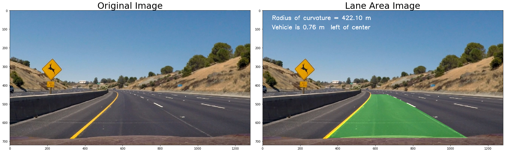

## 1. Camera Calibration
#### getting image points and object points


```python
# Camera calibration 
# To find distortion co-efficients

import numpy as np
import cv2
import matplotlib.pyplot as plt
import matplotlib.image as mpimg
import glob
%matplotlib inline

calib_images = glob.glob('./camera_cal/calibration*.jpg')

#img = mpimg.imread('./camera_cal/calibration1.jpg')#ret -> False
#img = mpimg.imread('./camera_cal/calibration2.jpg')#ret -> False

#plt.imshow(img)
nx = 9
ny = 6
objpoints = []
imgpoints =[]
objpt = np.zeros((ny*nx,3),np.float32)
#print(objpt)

# Chess board corner co-ordinates in 3D
objpt[:,:2] = np.mgrid[0:nx,0:ny].T.reshape(-1,2)
#print(objpt)

for f_name in calib_images:
    img = mpimg.imread(f_name)
    #Converting to gray for better corner detection
    gray = cv2.cvtColor(img,cv2.COLOR_RGB2GRAY)
    #plt.imshow(gray,cmap = 'gray')

    # Finding Corners on chessboard
    ret,corners = cv2.findChessboardCorners(gray, (nx,ny), None)
    #print(ret)

    if ret == True:
        imgpoints.append(corners)
        objpoints.append(objpt)
        #displaying corners
        #img = cv2.drawChessboardCorners(img,(nx,ny),corners,ret)
        #plt.imshow(img)

```


```python
#print(len(objpoints))
#print(imgpoints)
```


```python
# Camera Calibration
def Calibrate_camera(objpoints,imgpoints):
    return cv2.calibrateCamera(objpoints, imgpoints, gray.shape[::-1], None, None)

ret,mtx,dist,rvecs,tvecs = Calibrate_camera(objpoints,imgpoints)
print(mtx)

```

    [[  1.15290556e+03   0.00000000e+00   6.66492186e+02]
     [  0.00000000e+00   1.14676266e+03   3.86574197e+02]
     [  0.00000000e+00   0.00000000e+00   1.00000000e+00]]
    

## 2. Reading an image and undistorting it


```python
# Reading a road image with lane lines
rd_img = mpimg.imread('./test_images/test2.jpg')
#rd_img = mpimg.imread('./camera_cal/calibration2.jpg')
print(rd_img.shape)
# Undistorting the test image
def undistort_img(rd_img):
    dst = cv2.undistort(rd_img,mtx,dist)
    #plt.imshow(dst)
    return dst

```

    (720, 1280, 3)
    


```python
#Subplot Initialization to demo pipeline
f,(ax1,ax2) = plt.subplots(1,2,figsize = (24,9))
f.tight_layout()
#Plotting all the original and undstorted images on subplot
ax1.imshow(rd_img)
ax1.set_title('Original Image',fontsize=30)
undist_img = undistort_img(rd_img)
ax2.imshow(undist_img)
ax2.set_title('Undistorted Image',fontsize=30)
```


    <matplotlib.text.Text at 0x15a888be550>


## 3. Color map ,Sobel edge detection and perspective transform

#### Color map thresholding


```python
def sobel_with_color_chnl(rd_img):
    #Grayscale image of undistorted image
    undist_img = undistort_img(rd_img)
    rd_gray = cv2.cvtColor(undist_img,cv2.COLOR_RGB2GRAY)
    #plt.imshow(l_gray,cmap = 'gray')
    

    sobel_kernel = 3
    thres_min = 20
    thres_max = 180

    sobelx = cv2.Sobel(rd_gray,cv2.CV_64F,1,0)
    abs_sobelx = np.absolute(sobelx)

    scaled_sobel = np.uint8(255*abs_sobelx/np.max(abs_sobelx))
    sybinary = np.zeros_like(scaled_sobel)
    sybinary[(scaled_sobel >= thres_min) & (scaled_sobel <= thres_max)] = 1
    sobel_binary_output = np.copy(sybinary)
    #plt.imshow(sobel_binary_output,cmap='gray')
    #print(sobel_binary_output.shape)

    hls_img = cv2.cvtColor(undist_img,cv2.COLOR_RGB2HLS)
    # Choosing Saturation channel for gradient
    s_channel = hls_img[:,:,2]
    #plt.imshow(ls_img)
    l_channel = hls_img[:,:,1]
    #plt.imshow(ls_img,cmap = 'gray')
    #thres = (150,255)
    thres = (120,140)
    
    binary_s = np.zeros_like(s_channel)
    binary_s[(l_channel > thres[0]) & (s_channel > thres[1])] =1
    #plt.imshow(binary_s,cmap = 'gray')

    binary_image = sobel_binary_output | binary_s
    #plt.imshow(binary_image,cmap = 'gray')
    
    return binary_image
```


```python
binary_image = sobel_with_color_chnl(rd_img)
plt.imshow(binary_image,cmap = 'gray')
```


    <matplotlib.image.AxesImage at 0x22eab41bd68>


##### defining region of interest
##### v1 = [0,720] v2 = [1280,720] apx = [700,400]


```python
def roi_masked_img(binary_image):
    pv1 = np.array([[[100,720],[600,400],[800,400],[1200,720]]],dtype= np.int32)
    mask_img = np.zeros_like(binary_image)
    cv2.fillPoly(mask_img,pv1,1)

    binary_output = binary_image & mask_img
    return binary_output
    
```


```python
binary_output = roi_masked_img(binary_image)
plt.imshow(binary_output,cmap='gray')
plt.title('Masked image')
```


    <matplotlib.text.Text at 0x22eab4a8e80>


#### Perspective image for the masked image


```python
def perspec_matrix(binary_output):
    src_pts = np.float32([[590,450],[695,450],[1090,680],[230,680]])
    dst_pts = np.float32([[300,0],[950,0],[950,719],[300,719]])
    #Compute the perspective transform M
    M = cv2.getPerspectiveTransform(src_pts,dst_pts)
    #Compute the inverse perspective transform Minv
    Minv = cv2.getPerspectiveTransform(dst_pts,src_pts)
    # Create warped image using linear interpolation
    return M,Minv
def warped_img(binary_output):
    img_size = (binary_output.shape[1],binary_output.shape[0])
    warped_img = cv2.warpPerspective(binary_output,M,img_size,flags = cv2.INTER_LINEAR)
    return warped_img

```


```python
#Subplot Initialization for pileline demo
f,(ax1,ax2) = plt.subplots(1,2,figsize = (24,9))
f.tight_layout()
#Plotting all the original and undstorted images on subplot
ax1.imshow(binary_output,cmap='gray')
ax1.set_title('Masked Binary Image',fontsize=30)

M,Minv = perspec_matrix(binary_output)

# warped_img = warped_img(rd_img)
warped_img = warped_img(binary_output)
ax2.imshow(warped_img,cmap='gray')
ax2.set_title('Warped Image',fontsize=30)
```


    <matplotlib.text.Text at 0x22eab61add8>


```python
# Draw histogram of warped image
def plot_histogram(h_img):
    return np.sum(h_img[h_img.shape[0]//2:,:],axis = 0)

persp_img = np.copy(warped_img)
histogram = plot_histogram(persp_img)
plt.title('Lane line histogram')
plt.plot(histogram)
```


    [<matplotlib.lines.Line2D at 0x22eab6c5470>]


#### finding lane lines through sliding window 
###### In a perspective image


```python
# to draw lane lines polynomial and filling the polynomial
class Lanefill():
    def __init__(self):
        self.lane_coeff =[]
    def draw_lane_polynomials(self,rd_img):

        bin_image = sobel_with_color_chnl(rd_img)
        roi_bin_image = roi_masked_img(bin_image)
        persp_img = warped_img(roi_bin_image)

        binary_warp = np.copy(persp_img)
        
        # Create a depth 3 output image to draw and visualize lane lines
        out_img = np.dstack((binary_warp,binary_warp,binary_warp))*255
        #plt.imshow(out_img)
        # Identify all non-zero pixels im warped image
        nonzero = binary_warp.nonzero()

        nonzeroy = np.array(nonzero[0])
        nonzerox = np.array(nonzero[1])
        # margin of width for window
        margin = 100
        # minimum number of pixel in window to recentre window
        minpix = 50
        
        # taking a histogram of half of the image
        histogram = plot_histogram(binary_warp)
        # Finding left and right lane points on x-axis
        # these will be starting point of window
        midpoint = np.int(histogram.shape[0]//2)
        #print(midpoint)
        leftx_base = np.argmax(histogram[:midpoint])
        rightx_base = np.argmax(histogram[:midpoint]) + midpoint
        print(leftx_base,rightx_base)
        
        
        if len(self.lane_coeff) == 0:

            # Number of windows
            nwindows = 9
            window_height = np.int(binary_warp.shape[0]//nwindows)
            print(window_height)

#             # Identify all non-zero pixels im warped image
#             nonzero = binary_warp.nonzero()

#             nonzeroy = np.array(nonzero[0])
#             nonzerox = np.array(nonzero[1])
#             # margin of width for window
#             margin = 100
#             # minimum number of pixel in window to recentre window
#             minpix = 50

            #Empty list for left and right lane points
            left_lane_inds = []
            right_lane_inds = []

            #Iterating through windows
            for window in range(nwindows):#nwindows
                # window co-ords for left and right lane window
                win_y_low = binary_warp.shape[0] - (window+1)*window_height
                win_y_high = binary_warp.shape[0] - (window)*window_height
                win_xleft_low = leftx_base - margin
                win_xleft_high = leftx_base + margin
                win_xright_low = rightx_base - margin
                win_xright_high = rightx_base + margin
                #print(win_y_low,win_y_high)
                #print(win_xleft_low,win_xleft_high,win_xright_low,win_xright_high)

                # Identify non-zero pixels inside window from warped image
                good_left_inds = ((nonzeroy >= win_y_low) & (nonzeroy <= win_y_high) & (nonzerox >= win_xleft_low) & (nonzerox <= win_xleft_high)).nonzero()[0]
                good_right_inds = ((nonzeroy >= win_y_low) & (nonzeroy <= win_y_high) & (nonzerox >= win_xright_low) & (nonzerox <= win_xright_high)).nonzero()[0]

                # Append indices to list
                left_lane_inds.append(good_left_inds)
                right_lane_inds.append(good_right_inds)

                # If we find #pixels > minpix we need to recentre window to the mean of window x'co-ords
                if len(good_left_inds) > minpix:
                    leftx_base = np.int(np.mean(nonzerox[good_left_inds]))
                if len(good_right_inds) > minpix:
                    rightx_base = np.int(np.mean(nonzerox[good_right_inds]))

            left_lane_inds = np.concatenate(left_lane_inds)
            right_lane_inds = np.concatenate(right_lane_inds)

            # Extract left and right pixel co-ords
            leftx = nonzerox[left_lane_inds]
            lefty = nonzeroy[left_lane_inds]

            rightx = nonzerox[right_lane_inds]
            righty = nonzeroy[right_lane_inds]
        else:
            # Skipping the windowing part
            prev_left_lane_coeff = self.lane_coeff[-1][0]
            prev_right_lane_coeff = self.lane_coeff[-1][1]
            
            # Line window with offset
            left_lane_inds = ((nonzerox > (prev_left_lane_coeff[0] * (nonzeroy ** 2) + prev_left_lane_coeff[1] * nonzeroy + prev_left_lane_coeff[2] - margin)) 
                              & (nonzerox < (prev_left_lane_coeff[0] * (nonzeroy ** 2) + prev_left_lane_coeff[1] * nonzeroy + prev_left_lane_coeff[2] + margin)))
            
            right_lane_inds = ((nonzerox > (prev_right_lane_coeff[0] * (nonzeroy ** 2) + prev_right_lane_coeff[1] * nonzeroy + prev_right_lane_coeff[2] - margin)) 
                              & (nonzerox < (prev_right_lane_coeff[0] * (nonzeroy ** 2) + prev_right_lane_coeff[1] * nonzeroy + prev_right_lane_coeff[2] + margin)))
            
            # Extract left and right pixel co-ords
            leftx = nonzerox[left_lane_inds]
            lefty = nonzeroy[left_lane_inds]

            rightx = nonzerox[right_lane_inds]
            righty = nonzeroy[right_lane_inds]
            
        # Fit a 2nd order polynomial for left and right lanes
        left_fit = np.polyfit(lefty,leftx,2)
        right_fit = np.polyfit(righty,rightx,2)
        #print(left_fit,right_fit)
        
        # Adding line co efficients to global list for averaging or smoothening of line
        # Allowed #windows 10
        if len(self.lane_coeff) < 10:
            self.lane_coeff.append([left_fit.tolist(),right_fit.tolist()])
        else:
            self.lane_coeff = self.lane_coeff[1:]
            self.lane_coeff.append([left_fit.tolist(),right_fit.tolist()])
            
        # Taking averaged co-eff for the lane line for smoothening(if needed)
        la,lb,lc = 0,0,0
        ra,rb,rc = 0,0,0
        n_frames = len(self.lane_coeff)
        for ele in self.lane_coeff:
            # left lane co-eff
            la += ele[0][0]
            lb += ele[0][1]
            lc += ele[0][2]
            # Right lane co-eff
            ra += ele[1][0]
            rb += ele[1][1]
            rc += ele[1][2]
        n_left_lane_coeff = [la/n_frames,lb/n_frames,lc/n_frames]
        n_right_lane_coeff = [ra/n_frames,rb/n_frames,rc/n_frames]
        
        left_fit = n_left_lane_coeff
        right_fit = n_right_lane_coeff
        
        # lane pixel points 
        ploty = np.linspace(0,binary_warp.shape[0]-1,binary_warp.shape[0])
        left_fitx = left_fit[0]*ploty**2 + left_fit[1]*ploty + left_fit[2]
        right_fitx = right_fit[0]*ploty**2 + right_fit[1]*ploty + right_fit[2]
        
        ##############################################################
        # for writeup
        #binary_warp[nonzeroy[left_lane_inds], nonzerox[left_lane_inds]] = [255, 0, 0]
        #binary_warp[nonzeroy[right_lane_inds], nonzerox[right_lane_inds]] = [0, 0, 255]
        
#         plt.plot(left_fitx, ploty, color='red')
#         plt.plot(right_fitx, ploty, color='red')
#         plt.xlim(0, 1280)
#         plt.ylim(720, 0)
        
        ##############################################################
        # Calculation of Radious of curvature and Centre offset
        ##############################################################
        
        # Coversion factor for pixel to meter (In meter per pixel along the axis)
        ym_per_pixel = 30/720
        xm_per_pixel = 3.7/700
        # fit the polynomial in meter space
        left_fit_mtr = np.polyfit(ploty * ym_per_pixel, left_fitx * xm_per_pixel,2)
        right_fit_mtr = np.polyfit(ploty * ym_per_pixel, right_fitx * xm_per_pixel,2)
        
        y_eval = np.max(ploty)
        left_curve_rad = ((1+(2*left_fit_mtr[0]*y_eval*ym_per_pixel + left_fit_mtr[1] )**2)**1.5)/(np.absolute(2*left_fit_mtr[0]))
        right_curve_rad = ((1+(2*right_fit_mtr[0]*y_eval*ym_per_pixel + right_fit_mtr[1] )**2)**1.5)/(np.absolute(2*right_fit_mtr[0]))
        
        # 2 for mean 
        lane_curvature = (left_curve_rad + right_curve_rad)/2
        
        #Center offset calculation
        
#         #Polynomial approach
#         lane_center = rd_img.shape[0]//2
#         bottom_y_pt = rd_img.shape[0] -1
#         #print(bottom_y_pt)
#         left_lane_bt_pt = left_fit[0]*bottom_y_pt**2 + left_fit[1]*bottom_y_pt + left_fit[2]
#         print(left_lane_bt_pt)
#         right_lane_bt_pt = right_fit[0]*bottom_y_pt**2 + right_fit[1]*bottom_y_pt + right_fit[2]
#         print(right_lane_bt_pt)

#         # Histogram Approach
        lane_center,left_lane_bt_pt,right_lane_bt_pt = midpoint,leftx_base,rightx_base
        
        calc_lane_centre = left_lane_bt_pt + (right_lane_bt_pt - left_lane_bt_pt)//2
        print(calc_lane_centre)
        
        # negative : right positive : left
        center_offset = (lane_center - calc_lane_centre)*xm_per_pixel
        
        ##############################################################
        
        blank_img = np.zeros_like(persp_img)
        blank_img_lane = np.dstack((blank_img,blank_img,blank_img))
        #print(blank_img_lane.shape)

        #plt.imshow(blank_img,cmap = 'gray')
    #     plt.plot(left_fitx,ploty,color = 'yellow')
    #     plt.plot(right_fitx,ploty,color = 'yellow')
    #     plt.xlim(0, 1280)
    #     plt.ylim(720, 0)

        # coloring window detected pixels
    #     out_img[nonzeroy[left_lane_inds],nonzerox[left_lane_inds]] = [255,0,0]
    #     out_img[nonzeroy[right_lane_inds],nonzerox[right_lane_inds]] = [0,0,255]

        # Fill color between lane lines
        left_lane_poly_pts = np.array([np.transpose(np.vstack([left_fitx,ploty]))])
        right_lane_poly_pts = np.array([np.flipud(np.transpose(np.vstack([right_fitx,ploty])))])
        poly_points = np.hstack((left_lane_poly_pts,right_lane_poly_pts))

        cv2.fillPoly(blank_img_lane,np.int_([poly_points]),[0,255,0])

        # Inverse perspective transformation
        b_img_size = (blank_img_lane.shape[1],blank_img_lane.shape[0])
        unwarped_lane_area = cv2.warpPerspective(blank_img_lane,Minv,b_img_size,flags = cv2.INTER_LINEAR)

        img_lane_area_org = cv2.addWeighted(rd_img,1,unwarped_lane_area,0.3,0)
        #plt.imshow(img_lane_area_org)
        toward = 'left' if center_offset >= 0 else 'right'
        cv2.putText(img_lane_area_org,'Vehicle is {0:.2f} m '.format(abs(center_offset))+' '+toward+' of center',(50,100),cv2.FONT_HERSHEY_SIMPLEX,1,(255,255,255),2,cv2.LINE_AA)
        cv2.putText(img_lane_area_org,'Radius of curvature = {0:.2f} m '.format(lane_curvature),(50,50),cv2.FONT_HERSHEY_SIMPLEX,1,(255,255,255),2,cv2.LINE_AA)
        #print(len(self.lane_coeff))
        
        #return binary_warp for testing
        return img_lane_area_org
    

```


```python
#Subplot Initialization for pileline demo
f,(ax1,ax2) = plt.subplots(1,2,figsize = (24,9))
f.tight_layout()
#Plotting all the original and undstorted images on subplot
ax1.imshow(rd_img,cmap='gray')
ax1.set_title('Original Image',fontsize=30)
test_obj = Lanefill()
img_lane_area = test_obj.draw_lane_polynomials(rd_img)
ax2.imshow(img_lane_area,cmap='gray')
ax2.set_title('Lane Area Image',fontsize=30)
#ax2.set_title('Lane Line Polynomials',fontsize=30)
```

    370 1010
    80
    497
    


    <matplotlib.text.Text at 0x22eab849ba8>





```python
# Video processing code
from moviepy.editor import VideoFileClip
from IPython.display import HTML
pipe_obj = Lanefill()
video_output = './laneVideo.mp4'
clip1 = VideoFileClip("./project_video.mp4")
lane_clip = clip1.fl_image(pipe_obj.draw_lane_polynomials)
%time lane_clip.write_videofile(video_output,audio = False)
```

    367 1007
    80
    517
    [MoviePy] >>>> Building video ./laneVideo.mp4
    [MoviePy] Writing video ./laneVideo.mp4
    

      0%|                                                                                         | 0/1261 [00:00<?, ?it/s]

    367 1007
    687
    

      0%|                                                                                 | 1/1261 [00:00<05:46,  3.64it/s]

    364 1004
    684
    

      0%|▏                                                                                | 2/1261 [00:00<05:35,  3.75it/s]

    365 1005
    685
    

      0%|▏                                                                                | 3/1261 [00:00<05:31,  3.80it/s]

    366 1006
    686
    

      0%|▎                                                                                | 4/1261 [00:01<05:29,  3.82it/s]

    367 1007
    687
    

      0%|▎                                                                                | 5/1261 [00:01<05:26,  3.85it/s]

    369 1009
    689
    

      0%|▍                                                                                | 6/1261 [00:01<05:37,  3.72it/s]

    369 1009
    689
    

      1%|▍                                                                                | 7/1261 [00:01<05:31,  3.79it/s]

    372 1012
    692
    

      1%|▌                                                                                | 8/1261 [00:02<05:36,  3.72it/s]

    372 1012
    692
    

      1%|▌                                                                                | 9/1261 [00:02<05:27,  3.82it/s]

    372 1012
    692
    

      1%|▋                                                                               | 10/1261 [00:02<05:23,  3.87it/s]

    372 1012
    692
    

      1%|▋                                                                               | 11/1261 [00:02<05:15,  3.96it/s]

    369 1009
    689
    

      1%|▊                                                                               | 12/1261 [00:03<05:14,  3.97it/s]

    370 1010
    690
    

      1%|▊                                                                               | 13/1261 [00:03<05:14,  3.97it/s]

    370 1010
    690
    

      1%|▉                                                                               | 14/1261 [00:03<05:12,  3.99it/s]

    370 1010
    690
    

      1%|▉                                                                               | 15/1261 [00:03<05:11,  3.99it/s]

    371 1011
    691
    

      1%|█                                                                               | 16/1261 [00:04<05:10,  4.01it/s]

    370 1010
    690
    

      1%|█                                                                               | 17/1261 [00:04<05:12,  3.98it/s]

    370 1010
    690
    

      1%|█▏                                                                              | 18/1261 [00:04<05:11,  3.99it/s]

    370 1010
    690
    

      2%|█▏                                                                              | 19/1261 [00:04<05:12,  3.97it/s]

    366 1006
    686
    

      2%|█▎                                                                              | 20/1261 [00:05<05:10,  4.00it/s]

    366 1006
    686
    

      2%|█▎                                                                              | 21/1261 [00:05<05:10,  3.99it/s]

    348 988
    668
    

      2%|█▍                                                                              | 22/1261 [00:05<05:08,  4.02it/s]

    348 988
    668
    

      2%|█▍                                                                              | 23/1261 [00:05<05:11,  3.97it/s]

    355 995
    675
    

      2%|█▌                                                                              | 24/1261 [00:06<05:17,  3.89it/s]

    356 996
    676
    

      2%|█▌                                                                              | 25/1261 [00:06<05:13,  3.94it/s]

    359 999
    679
    

      2%|█▋                                                                              | 26/1261 [00:06<05:14,  3.93it/s]

    355 995
    675
    

      2%|█▋                                                                              | 27/1261 [00:06<05:13,  3.93it/s]

    349 989
    669
    

      2%|█▊                                                                              | 28/1261 [00:07<05:15,  3.91it/s]

    352 992
    672
    

      2%|█▊                                                                              | 29/1261 [00:07<05:17,  3.88it/s]

    350 990
    670
    

      2%|█▉                                                                              | 30/1261 [00:07<05:18,  3.87it/s]

    355 995
    675
    

      2%|█▉                                                                              | 31/1261 [00:07<05:16,  3.89it/s]

    354 994
    674
    

      3%|██                                                                              | 32/1261 [00:08<05:18,  3.86it/s]

    353 993
    673
    

      3%|██                                                                              | 33/1261 [00:08<05:17,  3.87it/s]

    355 995
    675
    

      3%|██▏                                                                             | 34/1261 [00:08<05:11,  3.94it/s]

    355 995
    675
    

      3%|██▏                                                                             | 35/1261 [00:08<05:05,  4.01it/s]

    358 998
    678
    

      3%|██▎                                                                             | 36/1261 [00:09<05:04,  4.03it/s]

    359 999
    679
    

      3%|██▎                                                                             | 37/1261 [00:09<05:10,  3.94it/s]

    361 1001
    681
    

      3%|██▍                                                                             | 38/1261 [00:09<05:12,  3.91it/s]

    361 1001
    681
    

      3%|██▍                                                                             | 39/1261 [00:09<05:09,  3.95it/s]

    362 1002
    682
    

      3%|██▌                                                                             | 40/1261 [00:10<05:02,  4.03it/s]

    362 1002
    682
    

      3%|██▌                                                                             | 41/1261 [00:10<05:02,  4.04it/s]

    362 1002
    682
    

      3%|██▋                                                                             | 42/1261 [00:10<04:58,  4.09it/s]

    363 1003
    683
    

      3%|██▋                                                                             | 43/1261 [00:10<05:03,  4.02it/s]

    363 1003
    683
    

      3%|██▊                                                                             | 44/1261 [00:11<05:12,  3.90it/s]

    363 1003
    683
    

      4%|██▊                                                                             | 45/1261 [00:11<05:12,  3.89it/s]

    363 1003
    683
    

      4%|██▉                                                                             | 46/1261 [00:11<05:03,  4.00it/s]

    362 1002
    682
    

      4%|██▉                                                                             | 47/1261 [00:11<05:06,  3.96it/s]

    363 1003
    683
    

      4%|███                                                                             | 48/1261 [00:12<05:07,  3.95it/s]

    362 1002
    682
    

      4%|███                                                                             | 49/1261 [00:12<05:08,  3.93it/s]

    363 1003
    683
    

      4%|███▏                                                                            | 50/1261 [00:12<05:10,  3.90it/s]

    363 1003
    683
    

      4%|███▏                                                                            | 51/1261 [00:12<05:08,  3.92it/s]

    364 1004
    684
    

      4%|███▎                                                                            | 52/1261 [00:13<05:11,  3.88it/s]

    364 1004
    684
    

      4%|███▎                                                                            | 53/1261 [00:13<05:10,  3.89it/s]

    364 1004
    684
    

      4%|███▍                                                                            | 54/1261 [00:13<05:10,  3.89it/s]

    364 1004
    684
    

      4%|███▍                                                                            | 55/1261 [00:14<05:15,  3.82it/s]

    363 1003
    683
    

      4%|███▌                                                                            | 56/1261 [00:14<05:11,  3.87it/s]

    363 1003
    683
    

      5%|███▌                                                                            | 57/1261 [00:14<05:15,  3.82it/s]

    361 1001
    681
    

      5%|███▋                                                                            | 58/1261 [00:14<05:14,  3.83it/s]

    362 1002
    682
    

      5%|███▋                                                                            | 59/1261 [00:15<05:17,  3.78it/s]

    363 1003
    683
    

      5%|███▊                                                                            | 60/1261 [00:15<05:21,  3.74it/s]

    346 986
    666
    

      5%|███▊                                                                            | 61/1261 [00:15<05:24,  3.70it/s]

    351 991
    671
    

      5%|███▉                                                                            | 62/1261 [00:15<05:56,  3.36it/s]

    354 994
    674
    

      5%|███▉                                                                            | 63/1261 [00:16<06:16,  3.18it/s]

    358 998
    678
    

      5%|████                                                                            | 64/1261 [00:16<06:57,  2.87it/s]

    357 997
    677
    

      5%|████                                                                            | 65/1261 [00:17<06:37,  3.01it/s]

    360 1000
    680
    

      5%|████▏                                                                           | 66/1261 [00:17<06:05,  3.27it/s]

    354 994
    674
    

      5%|████▎                                                                           | 67/1261 [00:17<05:58,  3.33it/s]

    352 992
    672
    

      5%|████▎                                                                           | 68/1261 [00:17<06:12,  3.21it/s]

    353 993
    673
    

      5%|████▍                                                                           | 69/1261 [00:18<06:08,  3.23it/s]

    350 990
    670
    

      6%|████▍                                                                           | 70/1261 [00:18<06:41,  2.96it/s]

    350 990
    670
    

      6%|████▌                                                                           | 71/1261 [00:18<06:24,  3.09it/s]

    348 988
    668
    

      6%|████▌                                                                           | 72/1261 [00:19<06:04,  3.26it/s]

    348 988
    668
    

      6%|████▋                                                                           | 73/1261 [00:19<05:52,  3.37it/s]

    348 988
    668
    

      6%|████▋                                                                           | 74/1261 [00:19<05:47,  3.41it/s]

    347 987
    667
    

      6%|████▊                                                                           | 75/1261 [00:20<05:38,  3.50it/s]

    347 987
    667
    

      6%|████▊                                                                           | 76/1261 [00:20<05:33,  3.56it/s]

    346 986
    666
    

      6%|████▉                                                                           | 77/1261 [00:20<05:29,  3.60it/s]

    345 985
    665
    

      6%|████▉                                                                           | 78/1261 [00:20<05:29,  3.59it/s]

    344 984
    664
    

      6%|█████                                                                           | 79/1261 [00:21<05:21,  3.68it/s]

    344 984
    664
    

      6%|█████                                                                           | 80/1261 [00:21<05:20,  3.68it/s]

    332 972
    652
    

      6%|█████▏                                                                          | 81/1261 [00:21<06:00,  3.27it/s]

    333 973
    653
    

      7%|█████▏                                                                          | 82/1261 [00:22<05:48,  3.39it/s]

    335 975
    655
    

      7%|█████▎                                                                          | 83/1261 [00:22<05:36,  3.51it/s]

    315 955
    635
    

      7%|█████▎                                                                          | 84/1261 [00:22<05:38,  3.48it/s]

    321 961
    641
    

      7%|█████▍                                                                          | 85/1261 [00:22<05:36,  3.50it/s]

    321 961
    641
    

      7%|█████▍                                                                          | 86/1261 [00:23<05:29,  3.56it/s]

    330 970
    650
    

      7%|█████▌                                                                          | 87/1261 [00:23<05:22,  3.64it/s]

    336 976
    656
    

      7%|█████▌                                                                          | 88/1261 [00:23<05:23,  3.62it/s]

    335 975
    655
    

      7%|█████▋                                                                          | 89/1261 [00:23<05:16,  3.71it/s]

    337 977
    657
    

      7%|█████▋                                                                          | 90/1261 [00:24<05:18,  3.68it/s]

    337 977
    657
    

      7%|█████▊                                                                          | 91/1261 [00:24<05:12,  3.74it/s]

    337 977
    657
    

      7%|█████▊                                                                          | 92/1261 [00:24<05:08,  3.79it/s]

    339 979
    659
    

      7%|█████▉                                                                          | 93/1261 [00:24<05:04,  3.84it/s]

    340 980
    660
    

      7%|█████▉                                                                          | 94/1261 [00:25<05:05,  3.82it/s]

    339 979
    659
    

      8%|██████                                                                          | 95/1261 [00:25<05:01,  3.86it/s]

    339 979
    659
    

      8%|██████                                                                          | 96/1261 [00:25<05:01,  3.87it/s]

    340 980
    660
    

      8%|██████▏                                                                         | 97/1261 [00:25<04:58,  3.90it/s]

    339 979
    659
    

      8%|██████▏                                                                         | 98/1261 [00:26<04:57,  3.91it/s]

    341 981
    661
    

      8%|██████▎                                                                         | 99/1261 [00:26<04:57,  3.90it/s]

    341 981
    661
    

      8%|██████▎                                                                        | 100/1261 [00:26<04:50,  3.99it/s]

    343 983
    663
    

      8%|██████▎                                                                        | 101/1261 [00:27<04:53,  3.96it/s]

    344 984
    664
    

      8%|██████▍                                                                        | 102/1261 [00:27<04:54,  3.94it/s]

    345 985
    665
    

      8%|██████▍                                                                        | 103/1261 [00:27<04:53,  3.95it/s]

    346 986
    666
    

      8%|██████▌                                                                        | 104/1261 [00:27<04:53,  3.95it/s]

    346 986
    666
    

      8%|██████▌                                                                        | 105/1261 [00:28<05:01,  3.83it/s]

    346 986
    666
    

      8%|██████▋                                                                        | 106/1261 [00:28<05:02,  3.82it/s]

    346 986
    666
    

      8%|██████▋                                                                        | 107/1261 [00:28<05:04,  3.79it/s]

    349 989
    669
    

      9%|██████▊                                                                        | 108/1261 [00:28<04:59,  3.85it/s]

    349 989
    669
    

      9%|██████▊                                                                        | 109/1261 [00:29<04:57,  3.87it/s]

    348 988
    668
    

      9%|██████▉                                                                        | 110/1261 [00:29<04:57,  3.87it/s]

    349 989
    669
    

      9%|██████▉                                                                        | 111/1261 [00:29<04:53,  3.92it/s]

    348 988
    668
    

      9%|███████                                                                        | 112/1261 [00:29<04:53,  3.92it/s]

    350 990
    670
    

      9%|███████                                                                        | 113/1261 [00:30<04:50,  3.95it/s]

    351 991
    671
    

      9%|███████▏                                                                       | 114/1261 [00:30<04:47,  3.99it/s]

    353 993
    673
    

      9%|███████▏                                                                       | 115/1261 [00:30<04:50,  3.95it/s]

    353 993
    673
    

      9%|███████▎                                                                       | 116/1261 [00:30<04:49,  3.95it/s]

    353 993
    673
    

      9%|███████▎                                                                       | 117/1261 [00:31<04:52,  3.91it/s]

    354 994
    674
    

      9%|███████▍                                                                       | 118/1261 [00:31<05:01,  3.79it/s]

    355 995
    675
    

      9%|███████▍                                                                       | 119/1261 [00:31<04:57,  3.84it/s]

    357 997
    677
    

     10%|███████▌                                                                       | 120/1261 [00:31<04:53,  3.88it/s]

    357 997
    677
    

     10%|███████▌                                                                       | 121/1261 [00:32<04:52,  3.90it/s]

    359 999
    679
    

     10%|███████▋                                                                       | 122/1261 [00:32<04:51,  3.91it/s]

    360 1000
    680
    

     10%|███████▋                                                                       | 123/1261 [00:32<04:48,  3.94it/s]

    362 1002
    682
    

     10%|███████▊                                                                       | 124/1261 [00:32<04:46,  3.97it/s]

    362 1002
    682
    

     10%|███████▊                                                                       | 125/1261 [00:33<04:45,  3.98it/s]

    362 1002
    682
    

     10%|███████▉                                                                       | 126/1261 [00:33<04:46,  3.95it/s]

    363 1003
    683
    

     10%|███████▉                                                                       | 127/1261 [00:33<04:48,  3.94it/s]

    363 1003
    683
    

     10%|████████                                                                       | 128/1261 [00:33<04:48,  3.93it/s]

    365 1005
    685
    

     10%|████████                                                                       | 129/1261 [00:34<04:46,  3.95it/s]

    365 1005
    685
    

     10%|████████▏                                                                      | 130/1261 [00:34<04:43,  3.99it/s]

    366 1006
    686
    

     10%|████████▏                                                                      | 131/1261 [00:34<04:46,  3.95it/s]

    367 1007
    687
    

     10%|████████▎                                                                      | 132/1261 [00:34<04:47,  3.93it/s]

    367 1007
    687
    

     11%|████████▎                                                                      | 133/1261 [00:35<04:46,  3.94it/s]

    369 1009
    689
    

     11%|████████▍                                                                      | 134/1261 [00:35<04:44,  3.96it/s]

    370 1010
    690
    

     11%|████████▍                                                                      | 135/1261 [00:35<04:44,  3.96it/s]

    371 1011
    691
    

     11%|████████▌                                                                      | 136/1261 [00:35<04:43,  3.97it/s]

    371 1011
    691
    

     11%|████████▌                                                                      | 137/1261 [00:36<04:45,  3.93it/s]

    368 1008
    688
    

     11%|████████▋                                                                      | 138/1261 [00:36<04:48,  3.89it/s]

    368 1008
    688
    

     11%|████████▋                                                                      | 139/1261 [00:36<04:48,  3.89it/s]

    367 1007
    687
    

     11%|████████▊                                                                      | 140/1261 [00:36<04:46,  3.91it/s]

    367 1007
    687
    

     11%|████████▊                                                                      | 141/1261 [00:37<04:42,  3.97it/s]

    367 1007
    687
    

     11%|████████▉                                                                      | 142/1261 [00:37<04:40,  3.98it/s]

    367 1007
    687
    

     11%|████████▉                                                                      | 143/1261 [00:37<04:37,  4.03it/s]

    366 1006
    686
    

     11%|█████████                                                                      | 144/1261 [00:37<04:41,  3.97it/s]

    366 1006
    686
    

     11%|█████████                                                                      | 145/1261 [00:38<04:36,  4.04it/s]

    365 1005
    685
    

     12%|█████████▏                                                                     | 146/1261 [00:38<04:38,  4.00it/s]

    365 1005
    685
    

     12%|█████████▏                                                                     | 147/1261 [00:38<04:37,  4.01it/s]

    366 1006
    686
    

     12%|█████████▎                                                                     | 148/1261 [00:38<04:38,  4.00it/s]

    366 1006
    686
    

     12%|█████████▎                                                                     | 149/1261 [00:39<04:38,  4.00it/s]

    367 1007
    687
    

     12%|█████████▍                                                                     | 150/1261 [00:39<04:39,  3.98it/s]

    366 1006
    686
    

     12%|█████████▍                                                                     | 151/1261 [00:39<04:40,  3.95it/s]

    365 1005
    685
    

     12%|█████████▌                                                                     | 152/1261 [00:39<04:44,  3.90it/s]

    363 1003
    683
    

     12%|█████████▌                                                                     | 153/1261 [00:40<04:43,  3.91it/s]

    362 1002
    682
    

     12%|█████████▋                                                                     | 154/1261 [00:40<04:44,  3.88it/s]

    362 1002
    682
    

     12%|█████████▋                                                                     | 155/1261 [00:40<04:42,  3.92it/s]

    362 1002
    682
    

     12%|█████████▊                                                                     | 156/1261 [00:40<04:41,  3.92it/s]

    361 1001
    681
    

     12%|█████████▊                                                                     | 157/1261 [00:41<04:41,  3.92it/s]

    362 1002
    682
    

     13%|█████████▉                                                                     | 158/1261 [00:41<04:41,  3.92it/s]

    357 997
    677
    

     13%|█████████▉                                                                     | 159/1261 [00:41<04:41,  3.92it/s]

    354 994
    674
    

     13%|██████████                                                                     | 160/1261 [00:42<04:40,  3.92it/s]

    353 993
    673
    

     13%|██████████                                                                     | 161/1261 [00:42<04:39,  3.94it/s]

    353 993
    673
    

     13%|██████████▏                                                                    | 162/1261 [00:42<04:37,  3.96it/s]

    352 992
    672
    

     13%|██████████▏                                                                    | 163/1261 [00:42<04:36,  3.98it/s]

    352 992
    672
    

     13%|██████████▎                                                                    | 164/1261 [00:43<04:37,  3.96it/s]

    353 993
    673
    

     13%|██████████▎                                                                    | 165/1261 [00:43<04:39,  3.92it/s]

    354 994
    674
    

     13%|██████████▍                                                                    | 166/1261 [00:43<04:37,  3.95it/s]

    354 994
    674
    

     13%|██████████▍                                                                    | 167/1261 [00:43<04:37,  3.94it/s]

    353 993
    673
    

     13%|██████████▌                                                                    | 168/1261 [00:44<04:40,  3.89it/s]

    352 992
    672
    

     13%|██████████▌                                                                    | 169/1261 [00:44<04:40,  3.90it/s]

    349 989
    669
    

     13%|██████████▋                                                                    | 170/1261 [00:44<04:38,  3.91it/s]

    349 989
    669
    

     14%|██████████▋                                                                    | 171/1261 [00:44<04:34,  3.97it/s]

    348 988
    668
    

     14%|██████████▊                                                                    | 172/1261 [00:45<04:33,  3.98it/s]

    347 987
    667
    

     14%|██████████▊                                                                    | 173/1261 [00:45<04:34,  3.97it/s]

    348 988
    668
    

     14%|██████████▉                                                                    | 174/1261 [00:45<04:31,  4.00it/s]

    348 988
    668
    

     14%|██████████▉                                                                    | 175/1261 [00:45<04:32,  3.99it/s]

    347 987
    667
    

     14%|███████████                                                                    | 176/1261 [00:46<04:30,  4.01it/s]

    345 985
    665
    

     14%|███████████                                                                    | 177/1261 [00:46<04:29,  4.03it/s]

    344 984
    664
    

     14%|███████████▏                                                                   | 178/1261 [00:46<05:02,  3.58it/s]

    345 985
    665
    

     14%|███████████▏                                                                   | 179/1261 [00:46<05:00,  3.60it/s]

    337 977
    657
    

     14%|███████████▎                                                                   | 180/1261 [00:47<04:57,  3.64it/s]

    342 982
    662
    

     14%|███████████▎                                                                   | 181/1261 [00:47<04:50,  3.71it/s]

    343 983
    663
    

     14%|███████████▍                                                                   | 182/1261 [00:47<04:45,  3.78it/s]

    343 983
    663
    

     15%|███████████▍                                                                   | 183/1261 [00:47<04:43,  3.80it/s]

    343 983
    663
    

     15%|███████████▌                                                                   | 184/1261 [00:48<04:44,  3.78it/s]

    344 984
    664
    

     15%|███████████▌                                                                   | 185/1261 [00:48<05:04,  3.54it/s]

    345 985
    665
    

     15%|███████████▋                                                                   | 186/1261 [00:48<04:59,  3.59it/s]

    344 984
    664
    

     15%|███████████▋                                                                   | 187/1261 [00:49<04:53,  3.66it/s]

    346 986
    666
    

     15%|███████████▊                                                                   | 188/1261 [00:49<04:51,  3.68it/s]

    347 987
    667
    

     15%|███████████▊                                                                   | 189/1261 [00:49<04:51,  3.68it/s]

    350 990
    670
    

     15%|███████████▉                                                                   | 190/1261 [00:49<04:50,  3.69it/s]

    354 994
    674
    

     15%|███████████▉                                                                   | 191/1261 [00:50<04:45,  3.75it/s]

    355 995
    675
    

     15%|████████████                                                                   | 192/1261 [00:50<04:45,  3.74it/s]

    358 998
    678
    

     15%|████████████                                                                   | 193/1261 [00:50<04:46,  3.72it/s]

    359 999
    679
    

     15%|████████████▏                                                                  | 194/1261 [00:50<04:44,  3.75it/s]

    360 1000
    680
    

     15%|████████████▏                                                                  | 195/1261 [00:51<04:44,  3.74it/s]

    358 998
    678
    

     16%|████████████▎                                                                  | 196/1261 [00:51<04:41,  3.79it/s]

    355 995
    675
    

     16%|████████████▎                                                                  | 197/1261 [00:51<04:39,  3.81it/s]

    352 992
    672
    

     16%|████████████▍                                                                  | 198/1261 [00:51<04:36,  3.85it/s]

    348 988
    668
    

     16%|████████████▍                                                                  | 199/1261 [00:52<04:34,  3.86it/s]

    348 988
    668
    

     16%|████████████▌                                                                  | 200/1261 [00:52<04:39,  3.80it/s]

    346 986
    666
    

     16%|████████████▌                                                                  | 201/1261 [00:52<04:42,  3.75it/s]

    345 985
    665
    

     16%|████████████▋                                                                  | 202/1261 [00:53<04:44,  3.72it/s]

    345 985
    665
    

     16%|████████████▋                                                                  | 203/1261 [00:53<04:41,  3.76it/s]

    343 983
    663
    

     16%|████████████▊                                                                  | 204/1261 [00:53<04:42,  3.75it/s]

    344 984
    664
    

     16%|████████████▊                                                                  | 205/1261 [00:53<04:40,  3.76it/s]

    345 985
    665
    

     16%|████████████▉                                                                  | 206/1261 [00:54<04:41,  3.74it/s]

    347 987
    667
    

     16%|████████████▉                                                                  | 207/1261 [00:54<04:37,  3.80it/s]

    348 988
    668
    

     16%|█████████████                                                                  | 208/1261 [00:54<04:43,  3.71it/s]

    348 988
    668
    

     17%|█████████████                                                                  | 209/1261 [00:54<04:40,  3.74it/s]

    348 988
    668
    

     17%|█████████████▏                                                                 | 210/1261 [00:55<04:38,  3.78it/s]

    347 987
    667
    

     17%|█████████████▏                                                                 | 211/1261 [00:55<04:35,  3.81it/s]

    348 988
    668
    

     17%|█████████████▎                                                                 | 212/1261 [00:55<04:35,  3.81it/s]

    347 987
    667
    

     17%|█████████████▎                                                                 | 213/1261 [00:55<04:35,  3.80it/s]

    346 986
    666
    

     17%|█████████████▍                                                                 | 214/1261 [00:56<04:40,  3.74it/s]

    345 985
    665
    

     17%|█████████████▍                                                                 | 215/1261 [00:56<04:36,  3.79it/s]

    345 985
    665
    

     17%|█████████████▌                                                                 | 216/1261 [00:56<04:30,  3.86it/s]

    343 983
    663
    

     17%|█████████████▌                                                                 | 217/1261 [00:57<04:30,  3.86it/s]

    341 981
    661
    

     17%|█████████████▋                                                                 | 218/1261 [00:57<04:28,  3.89it/s]

    341 981
    661
    

     17%|█████████████▋                                                                 | 219/1261 [00:57<04:29,  3.86it/s]

    340 980
    660
    

     17%|█████████████▊                                                                 | 220/1261 [00:57<04:30,  3.85it/s]

    342 982
    662
    

     18%|█████████████▊                                                                 | 221/1261 [00:58<04:31,  3.83it/s]

    342 982
    662
    

     18%|█████████████▉                                                                 | 222/1261 [00:58<04:29,  3.86it/s]

    343 983
    663
    

     18%|█████████████▉                                                                 | 223/1261 [00:58<04:30,  3.84it/s]

    345 985
    665
    

     18%|██████████████                                                                 | 224/1261 [00:58<04:30,  3.84it/s]

    343 983
    663
    

     18%|██████████████                                                                 | 225/1261 [00:59<04:29,  3.85it/s]

    341 981
    661
    

     18%|██████████████▏                                                                | 226/1261 [00:59<04:27,  3.87it/s]

    342 982
    662
    

     18%|██████████████▏                                                                | 227/1261 [00:59<04:28,  3.85it/s]

    341 981
    661
    

     18%|██████████████▎                                                                | 228/1261 [00:59<04:27,  3.86it/s]

    340 980
    660
    

     18%|██████████████▎                                                                | 229/1261 [01:00<04:29,  3.83it/s]

    338 978
    658
    

     18%|██████████████▍                                                                | 230/1261 [01:00<04:27,  3.86it/s]

    337 977
    657
    

     18%|██████████████▍                                                                | 231/1261 [01:00<04:28,  3.84it/s]

    335 975
    655
    

     18%|██████████████▌                                                                | 232/1261 [01:00<04:29,  3.82it/s]

    333 973
    653
    

     18%|██████████████▌                                                                | 233/1261 [01:01<04:31,  3.79it/s]

    331 971
    651
    

     19%|██████████████▋                                                                | 234/1261 [01:01<04:30,  3.80it/s]

    331 971
    651
    

     19%|██████████████▋                                                                | 235/1261 [01:01<04:33,  3.75it/s]

    331 971
    651
    

     19%|██████████████▊                                                                | 236/1261 [01:02<04:37,  3.70it/s]

    327 967
    647
    

     19%|██████████████▊                                                                | 237/1261 [01:02<04:34,  3.73it/s]

    329 969
    649
    

     19%|██████████████▉                                                                | 238/1261 [01:02<04:36,  3.70it/s]

    328 968
    648
    

     19%|██████████████▉                                                                | 239/1261 [01:02<04:34,  3.72it/s]

    326 966
    646
    

     19%|███████████████                                                                | 240/1261 [01:03<04:37,  3.68it/s]

    327 967
    647
    

     19%|███████████████                                                                | 241/1261 [01:03<04:34,  3.71it/s]

    319 959
    639
    

     19%|███████████████▏                                                               | 242/1261 [01:03<04:33,  3.73it/s]

    324 964
    644
    

     19%|███████████████▏                                                               | 243/1261 [01:03<04:31,  3.75it/s]

    323 963
    643
    

     19%|███████████████▎                                                               | 244/1261 [01:04<04:49,  3.52it/s]

    323 963
    643
    

     19%|███████████████▎                                                               | 245/1261 [01:04<04:46,  3.54it/s]

    323 963
    643
    

     20%|███████████████▍                                                               | 246/1261 [01:04<04:55,  3.44it/s]

    321 961
    641
    

     20%|███████████████▍                                                               | 247/1261 [01:05<04:51,  3.48it/s]

    322 962
    642
    

     20%|███████████████▌                                                               | 248/1261 [01:05<04:45,  3.55it/s]

    321 961
    641
    

     20%|███████████████▌                                                               | 249/1261 [01:05<04:42,  3.58it/s]

    321 961
    641
    

     20%|███████████████▋                                                               | 250/1261 [01:05<04:40,  3.61it/s]

    319 959
    639
    

     20%|███████████████▋                                                               | 251/1261 [01:06<04:43,  3.56it/s]

    319 959
    639
    

     20%|███████████████▊                                                               | 252/1261 [01:06<04:36,  3.65it/s]

    320 960
    640
    

     20%|███████████████▊                                                               | 253/1261 [01:06<04:33,  3.68it/s]

    320 960
    640
    

     20%|███████████████▉                                                               | 254/1261 [01:06<04:29,  3.74it/s]

    321 961
    641
    

     20%|███████████████▉                                                               | 255/1261 [01:07<04:31,  3.71it/s]

    321 961
    641
    

     20%|████████████████                                                               | 256/1261 [01:07<05:06,  3.28it/s]

    322 962
    642
    

     20%|████████████████                                                               | 257/1261 [01:07<04:58,  3.37it/s]

    321 961
    641
    

     20%|████████████████▏                                                              | 258/1261 [01:08<04:56,  3.38it/s]

    321 961
    641
    

     21%|████████████████▏                                                              | 259/1261 [01:08<04:59,  3.35it/s]

    323 963
    643
    

     21%|████████████████▎                                                              | 260/1261 [01:08<04:48,  3.47it/s]

    322 962
    642
    

     21%|████████████████▎                                                              | 261/1261 [01:09<04:36,  3.62it/s]

    324 964
    644
    

     21%|████████████████▍                                                              | 262/1261 [01:09<04:28,  3.72it/s]

    325 965
    645
    

     21%|████████████████▍                                                              | 263/1261 [01:09<04:23,  3.79it/s]

    325 965
    645
    

     21%|████████████████▌                                                              | 264/1261 [01:09<04:28,  3.71it/s]

    323 963
    643
    

     21%|████████████████▌                                                              | 265/1261 [01:10<04:22,  3.80it/s]

    323 963
    643
    

     21%|████████████████▋                                                              | 266/1261 [01:10<04:18,  3.85it/s]

    324 964
    644
    

     21%|████████████████▋                                                              | 267/1261 [01:10<04:16,  3.87it/s]

    323 963
    643
    

     21%|████████████████▊                                                              | 268/1261 [01:10<04:14,  3.90it/s]

    321 961
    641
    

     21%|████████████████▊                                                              | 269/1261 [01:11<04:13,  3.91it/s]

    321 961
    641
    

     21%|████████████████▉                                                              | 270/1261 [01:11<04:14,  3.90it/s]

    322 962
    642
    

     21%|████████████████▉                                                              | 271/1261 [01:11<04:17,  3.84it/s]

    324 964
    644
    

     22%|█████████████████                                                              | 272/1261 [01:11<04:28,  3.68it/s]

    325 965
    645
    

     22%|█████████████████                                                              | 273/1261 [01:12<04:47,  3.43it/s]

    328 968
    648
    

     22%|█████████████████▏                                                             | 274/1261 [01:12<04:54,  3.36it/s]

    329 969
    649
    

     22%|█████████████████▏                                                             | 275/1261 [01:12<04:58,  3.30it/s]

    328 968
    648
    

     22%|█████████████████▎                                                             | 276/1261 [01:13<04:54,  3.35it/s]

    329 969
    649
    

     22%|█████████████████▎                                                             | 277/1261 [01:13<05:02,  3.25it/s]

    329 969
    649
    

     22%|█████████████████▍                                                             | 278/1261 [01:13<04:56,  3.32it/s]

    331 971
    651
    

     22%|█████████████████▍                                                             | 279/1261 [01:14<04:52,  3.35it/s]

    331 971
    651
    

     22%|█████████████████▌                                                             | 280/1261 [01:14<04:50,  3.38it/s]

    332 972
    652
    

     22%|█████████████████▌                                                             | 281/1261 [01:14<04:50,  3.37it/s]

    334 974
    654
    

     22%|█████████████████▋                                                             | 282/1261 [01:14<04:48,  3.39it/s]

    335 975
    655
    

     22%|█████████████████▋                                                             | 283/1261 [01:15<04:51,  3.36it/s]

    336 976
    656
    

     23%|█████████████████▊                                                             | 284/1261 [01:15<04:46,  3.41it/s]

    337 977
    657
    

     23%|█████████████████▊                                                             | 285/1261 [01:15<04:44,  3.43it/s]

    337 977
    657
    

     23%|█████████████████▉                                                             | 286/1261 [01:16<04:41,  3.46it/s]

    338 978
    658
    

     23%|█████████████████▉                                                             | 287/1261 [01:16<04:42,  3.45it/s]

    337 977
    657
    

     23%|██████████████████                                                             | 288/1261 [01:16<04:39,  3.48it/s]

    341 981
    661
    

     23%|██████████████████                                                             | 289/1261 [01:16<04:41,  3.45it/s]

    340 980
    660
    

     23%|██████████████████▏                                                            | 290/1261 [01:17<04:28,  3.62it/s]

    342 982
    662
    

     23%|██████████████████▏                                                            | 291/1261 [01:17<04:20,  3.73it/s]

    344 984
    664
    

     23%|██████████████████▎                                                            | 292/1261 [01:17<04:12,  3.84it/s]

    344 984
    664
    

     23%|██████████████████▎                                                            | 293/1261 [01:17<04:10,  3.86it/s]

    346 986
    666
    

     23%|██████████████████▍                                                            | 294/1261 [01:18<04:07,  3.91it/s]

    346 986
    666
    

     23%|██████████████████▍                                                            | 295/1261 [01:18<04:06,  3.91it/s]

    346 986
    666
    

     23%|██████████████████▌                                                            | 296/1261 [01:18<04:04,  3.95it/s]

    346 986
    666
    

     24%|██████████████████▌                                                            | 297/1261 [01:18<04:01,  3.99it/s]

    346 986
    666
    

     24%|██████████████████▋                                                            | 298/1261 [01:19<04:01,  3.98it/s]

    346 986
    666
    

     24%|██████████████████▋                                                            | 299/1261 [01:19<03:59,  4.02it/s]

    345 985
    665
    

     24%|██████████████████▊                                                            | 300/1261 [01:19<03:59,  4.02it/s]

    345 985
    665
    

     24%|██████████████████▊                                                            | 301/1261 [01:19<03:56,  4.05it/s]

    344 984
    664
    

     24%|██████████████████▉                                                            | 302/1261 [01:20<04:00,  3.99it/s]

    343 983
    663
    

     24%|██████████████████▉                                                            | 303/1261 [01:20<03:57,  4.03it/s]

    343 983
    663
    

     24%|███████████████████                                                            | 304/1261 [01:20<04:00,  3.98it/s]

    342 982
    662
    

     24%|███████████████████                                                            | 305/1261 [01:20<03:59,  3.99it/s]

    343 983
    663
    

     24%|███████████████████▏                                                           | 306/1261 [01:21<03:57,  4.01it/s]

    343 983
    663
    

     24%|███████████████████▏                                                           | 307/1261 [01:21<04:00,  3.97it/s]

    346 986
    666
    

     24%|███████████████████▎                                                           | 308/1261 [01:21<04:00,  3.96it/s]

    346 986
    666
    

     25%|███████████████████▎                                                           | 309/1261 [01:21<04:00,  3.96it/s]

    347 987
    667
    

     25%|███████████████████▍                                                           | 310/1261 [01:22<03:58,  3.99it/s]

    349 989
    669
    

     25%|███████████████████▍                                                           | 311/1261 [01:22<03:59,  3.97it/s]

    351 991
    671
    

     25%|███████████████████▌                                                           | 312/1261 [01:22<04:03,  3.90it/s]

    353 993
    673
    

     25%|███████████████████▌                                                           | 313/1261 [01:22<04:00,  3.94it/s]

    352 992
    672
    

     25%|███████████████████▋                                                           | 314/1261 [01:23<03:59,  3.95it/s]

    353 993
    673
    

     25%|███████████████████▋                                                           | 315/1261 [01:23<04:00,  3.94it/s]

    352 992
    672
    

     25%|███████████████████▊                                                           | 316/1261 [01:23<04:01,  3.92it/s]

    352 992
    672
    

     25%|███████████████████▊                                                           | 317/1261 [01:24<04:10,  3.76it/s]

    354 994
    674
    

     25%|███████████████████▉                                                           | 318/1261 [01:24<04:12,  3.74it/s]

    354 994
    674
    

     25%|███████████████████▉                                                           | 319/1261 [01:24<04:09,  3.78it/s]

    356 996
    676
    

     25%|████████████████████                                                           | 320/1261 [01:24<04:06,  3.82it/s]

    356 996
    676
    

     25%|████████████████████                                                           | 321/1261 [01:25<04:10,  3.76it/s]

    356 996
    676
    

     26%|████████████████████▏                                                          | 322/1261 [01:25<04:04,  3.83it/s]

    356 996
    676
    

     26%|████████████████████▏                                                          | 323/1261 [01:25<04:02,  3.86it/s]

    354 994
    674
    

     26%|████████████████████▎                                                          | 324/1261 [01:25<04:00,  3.90it/s]

    355 995
    675
    

     26%|████████████████████▎                                                          | 325/1261 [01:26<04:08,  3.77it/s]

    355 995
    675
    

     26%|████████████████████▍                                                          | 326/1261 [01:26<04:16,  3.64it/s]

    354 994
    674
    

     26%|████████████████████▍                                                          | 327/1261 [01:26<04:18,  3.61it/s]

    352 992
    672
    

     26%|████████████████████▌                                                          | 328/1261 [01:26<04:17,  3.62it/s]

    350 990
    670
    

     26%|████████████████████▌                                                          | 329/1261 [01:27<04:18,  3.60it/s]

    351 991
    671
    

     26%|████████████████████▋                                                          | 330/1261 [01:27<04:21,  3.57it/s]

    351 991
    671
    

     26%|████████████████████▋                                                          | 331/1261 [01:27<04:23,  3.53it/s]

    355 995
    675
    

     26%|████████████████████▊                                                          | 332/1261 [01:28<04:26,  3.49it/s]

    360 1000
    680
    

     26%|████████████████████▊                                                          | 333/1261 [01:28<04:27,  3.47it/s]

    359 999
    679
    

     26%|████████████████████▉                                                          | 334/1261 [01:28<04:35,  3.37it/s]

    360 1000
    680
    

     27%|████████████████████▉                                                          | 335/1261 [01:29<04:31,  3.41it/s]

    352 992
    672
    

     27%|█████████████████████                                                          | 336/1261 [01:29<04:32,  3.40it/s]

    352 992
    672
    

     27%|█████████████████████                                                          | 337/1261 [01:29<04:27,  3.46it/s]

    353 993
    673
    

     27%|█████████████████████▏                                                         | 338/1261 [01:29<04:28,  3.43it/s]

    353 993
    673
    

     27%|█████████████████████▏                                                         | 339/1261 [01:30<04:26,  3.46it/s]

    357 997
    677
    

     27%|█████████████████████▎                                                         | 340/1261 [01:30<04:25,  3.47it/s]

    357 997
    677
    

     27%|█████████████████████▎                                                         | 341/1261 [01:30<04:25,  3.47it/s]

    362 1002
    682
    

     27%|█████████████████████▍                                                         | 342/1261 [01:31<04:25,  3.46it/s]

    359 999
    679
    

     27%|█████████████████████▍                                                         | 343/1261 [01:31<04:54,  3.12it/s]

    356 996
    676
    

     27%|█████████████████████▌                                                         | 344/1261 [01:31<04:46,  3.20it/s]

    356 996
    676
    

     27%|█████████████████████▌                                                         | 345/1261 [01:31<04:35,  3.32it/s]

    354 994
    674
    

     27%|█████████████████████▋                                                         | 346/1261 [01:32<04:24,  3.46it/s]

    356 996
    676
    

     28%|█████████████████████▋                                                         | 347/1261 [01:32<04:25,  3.45it/s]

    355 995
    675
    

     28%|█████████████████████▊                                                         | 348/1261 [01:32<04:23,  3.46it/s]

    355 995
    675
    

     28%|█████████████████████▊                                                         | 349/1261 [01:33<04:15,  3.57it/s]

    355 995
    675
    

     28%|█████████████████████▉                                                         | 350/1261 [01:33<04:11,  3.63it/s]

    355 995
    675
    

     28%|█████████████████████▉                                                         | 351/1261 [01:33<04:07,  3.68it/s]

    354 994
    674
    

     28%|██████████████████████                                                         | 352/1261 [01:33<04:06,  3.68it/s]

    352 992
    672
    

     28%|██████████████████████                                                         | 353/1261 [01:34<04:03,  3.73it/s]

    353 993
    673
    

     28%|██████████████████████▏                                                        | 354/1261 [01:34<04:01,  3.76it/s]

    352 992
    672
    

     28%|██████████████████████▏                                                        | 355/1261 [01:34<03:56,  3.83it/s]

    353 993
    673
    

     28%|██████████████████████▎                                                        | 356/1261 [01:34<03:55,  3.85it/s]

    357 997
    677
    

     28%|██████████████████████▎                                                        | 357/1261 [01:35<03:53,  3.88it/s]

    356 996
    676
    

     28%|██████████████████████▍                                                        | 358/1261 [01:35<03:52,  3.89it/s]

    359 999
    679
    

     28%|██████████████████████▍                                                        | 359/1261 [01:35<03:49,  3.93it/s]

    359 999
    679
    

     29%|██████████████████████▌                                                        | 360/1261 [01:35<03:50,  3.90it/s]

    359 999
    679
    

     29%|██████████████████████▌                                                        | 361/1261 [01:36<03:50,  3.90it/s]

    361 1001
    681
    

     29%|██████████████████████▋                                                        | 362/1261 [01:36<03:50,  3.90it/s]

    360 1000
    680
    

     29%|██████████████████████▋                                                        | 363/1261 [01:36<03:48,  3.92it/s]

    363 1003
    683
    

     29%|██████████████████████▊                                                        | 364/1261 [01:36<03:47,  3.94it/s]

    362 1002
    682
    

     29%|██████████████████████▊                                                        | 365/1261 [01:37<03:48,  3.93it/s]

    362 1002
    682
    

     29%|██████████████████████▉                                                        | 366/1261 [01:37<03:48,  3.92it/s]

    361 1001
    681
    

     29%|██████████████████████▉                                                        | 367/1261 [01:37<03:47,  3.93it/s]

    360 1000
    680
    

     29%|███████████████████████                                                        | 368/1261 [01:37<03:46,  3.93it/s]

    361 1001
    681
    

     29%|███████████████████████                                                        | 369/1261 [01:38<03:46,  3.94it/s]

    359 999
    679
    

     29%|███████████████████████▏                                                       | 370/1261 [01:38<03:45,  3.94it/s]

    359 999
    679
    

     29%|███████████████████████▏                                                       | 371/1261 [01:38<03:43,  3.98it/s]

    356 996
    676
    

     30%|███████████████████████▎                                                       | 372/1261 [01:38<03:43,  3.97it/s]

    355 995
    675
    

     30%|███████████████████████▎                                                       | 373/1261 [01:39<03:44,  3.96it/s]

    359 999
    679
    

     30%|███████████████████████▍                                                       | 374/1261 [01:39<03:44,  3.95it/s]

    360 1000
    680
    

     30%|███████████████████████▍                                                       | 375/1261 [01:39<03:41,  4.00it/s]

    367 1007
    687
    

     30%|███████████████████████▌                                                       | 376/1261 [01:39<03:42,  3.98it/s]

    367 1007
    687
    

     30%|███████████████████████▌                                                       | 377/1261 [01:40<03:42,  3.98it/s]

    369 1009
    689
    

     30%|███████████████████████▋                                                       | 378/1261 [01:40<03:42,  3.97it/s]

    366 1006
    686
    

     30%|███████████████████████▋                                                       | 379/1261 [01:40<03:42,  3.97it/s]

    364 1004
    684
    

     30%|███████████████████████▊                                                       | 380/1261 [01:40<03:40,  4.00it/s]

    362 1002
    682
    

     30%|███████████████████████▊                                                       | 381/1261 [01:41<03:44,  3.93it/s]

    361 1001
    681
    

     30%|███████████████████████▉                                                       | 382/1261 [01:41<03:41,  3.96it/s]

    362 1002
    682
    

     30%|███████████████████████▉                                                       | 383/1261 [01:41<03:43,  3.94it/s]

    361 1001
    681
    

     30%|████████████████████████                                                       | 384/1261 [01:42<03:40,  3.97it/s]

    360 1000
    680
    

     31%|████████████████████████                                                       | 385/1261 [01:42<03:40,  3.97it/s]

    358 998
    678
    

     31%|████████████████████████▏                                                      | 386/1261 [01:42<03:41,  3.94it/s]

    354 994
    674
    

     31%|████████████████████████▏                                                      | 387/1261 [01:42<03:40,  3.97it/s]

    356 996
    676
    

     31%|████████████████████████▎                                                      | 388/1261 [01:43<03:40,  3.96it/s]

    353 993
    673
    

     31%|████████████████████████▎                                                      | 389/1261 [01:43<03:40,  3.96it/s]

    351 991
    671
    

     31%|████████████████████████▍                                                      | 390/1261 [01:43<03:41,  3.93it/s]

    350 990
    670
    

     31%|████████████████████████▍                                                      | 391/1261 [01:43<03:38,  3.97it/s]

    350 990
    670
    

     31%|████████████████████████▌                                                      | 392/1261 [01:44<03:40,  3.93it/s]

    351 991
    671
    

     31%|████████████████████████▌                                                      | 393/1261 [01:44<03:40,  3.94it/s]

    351 991
    671
    

     31%|████████████████████████▋                                                      | 394/1261 [01:44<03:41,  3.92it/s]

    350 990
    670
    

     31%|████████████████████████▋                                                      | 395/1261 [01:44<03:40,  3.93it/s]

    349 989
    669
    

     31%|████████████████████████▊                                                      | 396/1261 [01:45<03:41,  3.90it/s]

    348 988
    668
    

     31%|████████████████████████▊                                                      | 397/1261 [01:45<03:40,  3.93it/s]

    348 988
    668
    

     32%|████████████████████████▉                                                      | 398/1261 [01:45<03:42,  3.87it/s]

    345 985
    665
    

     32%|████████████████████████▉                                                      | 399/1261 [01:45<03:42,  3.87it/s]

    345 985
    665
    

     32%|█████████████████████████                                                      | 400/1261 [01:46<03:39,  3.91it/s]

    344 984
    664
    

     32%|█████████████████████████                                                      | 401/1261 [01:46<03:39,  3.91it/s]

    343 983
    663
    

     32%|█████████████████████████▏                                                     | 402/1261 [01:46<03:43,  3.84it/s]

    343 983
    663
    

     32%|█████████████████████████▏                                                     | 403/1261 [01:46<03:41,  3.87it/s]

    342 982
    662
    

     32%|█████████████████████████▎                                                     | 404/1261 [01:47<03:41,  3.87it/s]

    342 982
    662
    

     32%|█████████████████████████▎                                                     | 405/1261 [01:47<03:41,  3.86it/s]

    341 981
    661
    

     32%|█████████████████████████▍                                                     | 406/1261 [01:47<03:39,  3.89it/s]

    340 980
    660
    

     32%|█████████████████████████▍                                                     | 407/1261 [01:47<03:36,  3.95it/s]

    340 980
    660
    

     32%|█████████████████████████▌                                                     | 408/1261 [01:48<03:35,  3.95it/s]

    340 980
    660
    

     32%|█████████████████████████▌                                                     | 409/1261 [01:48<03:34,  3.98it/s]

    340 980
    660
    

     33%|█████████████████████████▋                                                     | 410/1261 [01:48<04:05,  3.46it/s]

    339 979
    659
    

     33%|█████████████████████████▋                                                     | 411/1261 [01:49<03:58,  3.57it/s]

    338 978
    658
    

     33%|█████████████████████████▊                                                     | 412/1261 [01:49<03:52,  3.65it/s]

    339 979
    659
    

     33%|█████████████████████████▊                                                     | 413/1261 [01:49<03:50,  3.68it/s]

    340 980
    660
    

     33%|█████████████████████████▉                                                     | 414/1261 [01:49<03:46,  3.74it/s]

    338 978
    658
    

     33%|█████████████████████████▉                                                     | 415/1261 [01:50<03:44,  3.76it/s]

    334 974
    654
    

     33%|██████████████████████████                                                     | 416/1261 [01:50<03:41,  3.82it/s]

    334 974
    654
    

     33%|██████████████████████████                                                     | 417/1261 [01:50<03:40,  3.83it/s]

    333 973
    653
    

     33%|██████████████████████████▏                                                    | 418/1261 [01:50<03:39,  3.84it/s]

    332 972
    652
    

     33%|██████████████████████████▏                                                    | 419/1261 [01:51<03:39,  3.83it/s]

    333 973
    653
    

     33%|██████████████████████████▎                                                    | 420/1261 [01:51<03:39,  3.83it/s]

    333 973
    653
    

     33%|██████████████████████████▍                                                    | 421/1261 [01:51<03:41,  3.80it/s]

    334 974
    654
    

     33%|██████████████████████████▍                                                    | 422/1261 [01:51<03:50,  3.63it/s]

    332 972
    652
    

     34%|██████████████████████████▌                                                    | 423/1261 [01:52<03:51,  3.63it/s]

    331 971
    651
    

     34%|██████████████████████████▌                                                    | 424/1261 [01:52<03:50,  3.63it/s]

    331 971
    651
    

     34%|██████████████████████████▋                                                    | 425/1261 [01:52<03:46,  3.68it/s]

    329 969
    649
    

     34%|██████████████████████████▋                                                    | 426/1261 [01:53<03:45,  3.71it/s]

    329 969
    649
    

     34%|██████████████████████████▊                                                    | 427/1261 [01:53<03:43,  3.73it/s]

    328 968
    648
    

     34%|██████████████████████████▊                                                    | 428/1261 [01:53<03:41,  3.76it/s]

    328 968
    648
    

     34%|██████████████████████████▉                                                    | 429/1261 [01:53<03:44,  3.71it/s]

    327 967
    647
    

     34%|██████████████████████████▉                                                    | 430/1261 [01:54<03:51,  3.58it/s]

    326 966
    646
    

     34%|███████████████████████████                                                    | 431/1261 [01:54<03:46,  3.66it/s]

    326 966
    646
    

     34%|███████████████████████████                                                    | 432/1261 [01:54<03:42,  3.73it/s]

    324 964
    644
    

     34%|███████████████████████████▏                                                   | 433/1261 [01:54<03:41,  3.74it/s]

    324 964
    644
    

     34%|███████████████████████████▏                                                   | 434/1261 [01:55<03:43,  3.69it/s]

    323 963
    643
    

     34%|███████████████████████████▎                                                   | 435/1261 [01:55<03:45,  3.67it/s]

    323 963
    643
    

     35%|███████████████████████████▎                                                   | 436/1261 [01:55<03:39,  3.75it/s]

    324 964
    644
    

     35%|███████████████████████████▍                                                   | 437/1261 [01:55<03:36,  3.80it/s]

    323 963
    643
    

     35%|███████████████████████████▍                                                   | 438/1261 [01:56<03:39,  3.74it/s]

    324 964
    644
    

     35%|███████████████████████████▌                                                   | 439/1261 [01:56<03:35,  3.81it/s]

    325 965
    645
    

     35%|███████████████████████████▌                                                   | 440/1261 [01:56<03:34,  3.84it/s]

    324 964
    644
    

     35%|███████████████████████████▋                                                   | 441/1261 [01:56<03:31,  3.88it/s]

    323 963
    643
    

     35%|███████████████████████████▋                                                   | 442/1261 [01:57<03:28,  3.93it/s]

    320 960
    640
    

     35%|███████████████████████████▊                                                   | 443/1261 [01:57<03:28,  3.92it/s]

    319 959
    639
    

     35%|███████████████████████████▊                                                   | 444/1261 [01:57<03:28,  3.92it/s]

    317 957
    637
    

     35%|███████████████████████████▉                                                   | 445/1261 [01:58<03:28,  3.92it/s]

    317 957
    637
    

     35%|███████████████████████████▉                                                   | 446/1261 [01:58<03:29,  3.88it/s]

    317 957
    637
    

     35%|████████████████████████████                                                   | 447/1261 [01:58<03:45,  3.61it/s]

    316 956
    636
    

     36%|████████████████████████████                                                   | 448/1261 [01:58<03:39,  3.70it/s]

    317 957
    637
    

     36%|████████████████████████████▏                                                  | 449/1261 [01:59<03:38,  3.72it/s]

    316 956
    636
    

     36%|████████████████████████████▏                                                  | 450/1261 [01:59<03:35,  3.76it/s]

    317 957
    637
    

     36%|████████████████████████████▎                                                  | 451/1261 [01:59<03:33,  3.79it/s]

    317 957
    637
    

     36%|████████████████████████████▎                                                  | 452/1261 [01:59<03:30,  3.83it/s]

    316 956
    636
    

     36%|████████████████████████████▍                                                  | 453/1261 [02:00<03:28,  3.87it/s]

    323 963
    643
    

     36%|████████████████████████████▍                                                  | 454/1261 [02:00<03:26,  3.92it/s]

    323 963
    643
    

     36%|████████████████████████████▌                                                  | 455/1261 [02:00<03:27,  3.88it/s]

    324 964
    644
    

     36%|████████████████████████████▌                                                  | 456/1261 [02:00<03:22,  3.97it/s]

    329 969
    649
    

     36%|████████████████████████████▋                                                  | 457/1261 [02:01<03:24,  3.94it/s]

    329 969
    649
    

     36%|████████████████████████████▋                                                  | 458/1261 [02:01<03:22,  3.97it/s]

    335 975
    655
    

     36%|████████████████████████████▊                                                  | 459/1261 [02:01<03:22,  3.96it/s]

    333 973
    653
    

     36%|████████████████████████████▊                                                  | 460/1261 [02:01<03:20,  4.00it/s]

    333 973
    653
    

     37%|████████████████████████████▉                                                  | 461/1261 [02:02<03:20,  4.00it/s]

    331 971
    651
    

     37%|████████████████████████████▉                                                  | 462/1261 [02:02<03:21,  3.97it/s]

    328 968
    648
    

     37%|█████████████████████████████                                                  | 463/1261 [02:02<03:23,  3.92it/s]

    333 973
    653
    

     37%|█████████████████████████████                                                  | 464/1261 [02:02<03:22,  3.93it/s]

    333 973
    653
    

     37%|█████████████████████████████▏                                                 | 465/1261 [02:03<03:21,  3.95it/s]

    335 975
    655
    

     37%|█████████████████████████████▏                                                 | 466/1261 [02:03<03:22,  3.93it/s]

    335 975
    655
    

     37%|█████████████████████████████▎                                                 | 467/1261 [02:03<03:23,  3.91it/s]

    334 974
    654
    

     37%|█████████████████████████████▎                                                 | 468/1261 [02:03<03:22,  3.91it/s]

    333 973
    653
    

     37%|█████████████████████████████▍                                                 | 469/1261 [02:04<03:23,  3.89it/s]

    328 968
    648
    

     37%|█████████████████████████████▍                                                 | 470/1261 [02:04<03:23,  3.88it/s]

    331 971
    651
    

     37%|█████████████████████████████▌                                                 | 471/1261 [02:04<03:22,  3.90it/s]

    330 970
    650
    

     37%|█████████████████████████████▌                                                 | 472/1261 [02:04<03:20,  3.94it/s]

    329 969
    649
    

     38%|█████████████████████████████▋                                                 | 473/1261 [02:05<03:19,  3.95it/s]

    331 971
    651
    

     38%|█████████████████████████████▋                                                 | 474/1261 [02:05<03:18,  3.97it/s]

    327 967
    647
    

     38%|█████████████████████████████▊                                                 | 475/1261 [02:05<03:18,  3.96it/s]

    328 968
    648
    

     38%|█████████████████████████████▊                                                 | 476/1261 [02:05<03:19,  3.94it/s]

    326 966
    646
    

     38%|█████████████████████████████▉                                                 | 477/1261 [02:06<03:19,  3.93it/s]

    325 965
    645
    

     38%|█████████████████████████████▉                                                 | 478/1261 [02:06<03:19,  3.93it/s]

    325 965
    645
    

     38%|██████████████████████████████                                                 | 479/1261 [02:06<03:21,  3.88it/s]

    324 964
    644
    

     38%|██████████████████████████████                                                 | 480/1261 [02:07<03:31,  3.69it/s]

    325 965
    645
    

     38%|██████████████████████████████▏                                                | 481/1261 [02:07<03:31,  3.69it/s]

    324 964
    644
    

     38%|██████████████████████████████▏                                                | 482/1261 [02:07<03:28,  3.73it/s]

    322 962
    642
    

     38%|██████████████████████████████▎                                                | 483/1261 [02:07<03:30,  3.70it/s]

    323 963
    643
    

     38%|██████████████████████████████▎                                                | 484/1261 [02:08<03:29,  3.71it/s]

    322 962
    642
    

     38%|██████████████████████████████▍                                                | 485/1261 [02:08<03:30,  3.69it/s]

    322 962
    642
    

     39%|██████████████████████████████▍                                                | 486/1261 [02:08<03:24,  3.78it/s]

    323 963
    643
    

     39%|██████████████████████████████▌                                                | 487/1261 [02:08<03:22,  3.82it/s]

    326 966
    646
    

     39%|██████████████████████████████▌                                                | 488/1261 [02:09<03:20,  3.86it/s]

    331 971
    651
    

     39%|██████████████████████████████▋                                                | 489/1261 [02:09<03:21,  3.84it/s]

    329 969
    649
    

     39%|██████████████████████████████▋                                                | 490/1261 [02:09<03:22,  3.80it/s]

    331 971
    651
    

     39%|██████████████████████████████▊                                                | 491/1261 [02:09<03:19,  3.86it/s]

    327 967
    647
    

     39%|██████████████████████████████▊                                                | 492/1261 [02:10<03:17,  3.89it/s]

    328 968
    648
    

     39%|██████████████████████████████▉                                                | 493/1261 [02:10<03:16,  3.91it/s]

    323 963
    643
    

     39%|██████████████████████████████▉                                                | 494/1261 [02:10<03:13,  3.96it/s]

    323 963
    643
    

     39%|███████████████████████████████                                                | 495/1261 [02:10<03:13,  3.97it/s]

    323 963
    643
    

     39%|███████████████████████████████                                                | 496/1261 [02:11<03:10,  4.01it/s]

    325 965
    645
    

     39%|███████████████████████████████▏                                               | 497/1261 [02:11<03:10,  4.01it/s]

    326 966
    646
    

     39%|███████████████████████████████▏                                               | 498/1261 [02:11<03:11,  3.98it/s]

    324 964
    644
    

     40%|███████████████████████████████▎                                               | 499/1261 [02:11<03:12,  3.95it/s]

    321 961
    641
    

     40%|███████████████████████████████▎                                               | 500/1261 [02:12<03:12,  3.96it/s]

    322 962
    642
    

     40%|███████████████████████████████▍                                               | 501/1261 [02:12<03:12,  3.94it/s]

    319 959
    639
    

     40%|███████████████████████████████▍                                               | 502/1261 [02:12<03:12,  3.95it/s]

    321 961
    641
    

     40%|███████████████████████████████▌                                               | 503/1261 [02:12<03:11,  3.95it/s]

    321 961
    641
    

     40%|███████████████████████████████▌                                               | 504/1261 [02:13<03:12,  3.94it/s]

    321 961
    641
    

     40%|███████████████████████████████▋                                               | 505/1261 [02:13<03:10,  3.97it/s]

    322 962
    642
    

     40%|███████████████████████████████▋                                               | 506/1261 [02:13<03:10,  3.97it/s]

    321 961
    641
    

     40%|███████████████████████████████▊                                               | 507/1261 [02:13<03:09,  3.98it/s]

    321 961
    641
    

     40%|███████████████████████████████▊                                               | 508/1261 [02:14<03:08,  3.99it/s]

    320 960
    640
    

     40%|███████████████████████████████▉                                               | 509/1261 [02:14<03:09,  3.97it/s]

    320 960
    640
    

     40%|███████████████████████████████▉                                               | 510/1261 [02:14<03:09,  3.96it/s]

    320 960
    640
    

     41%|████████████████████████████████                                               | 511/1261 [02:14<03:09,  3.96it/s]

    320 960
    640
    

     41%|████████████████████████████████                                               | 512/1261 [02:15<03:10,  3.92it/s]

    322 962
    642
    

     41%|████████████████████████████████▏                                              | 513/1261 [02:15<03:10,  3.93it/s]

    321 961
    641
    

     41%|████████████████████████████████▏                                              | 514/1261 [02:15<03:11,  3.91it/s]

    322 962
    642
    

     41%|████████████████████████████████▎                                              | 515/1261 [02:15<03:08,  3.96it/s]

    322 962
    642
    

     41%|████████████████████████████████▎                                              | 516/1261 [02:16<03:09,  3.93it/s]

    321 961
    641
    

     41%|████████████████████████████████▍                                              | 517/1261 [02:16<03:19,  3.73it/s]

    321 961
    641
    

     41%|████████████████████████████████▍                                              | 518/1261 [02:16<03:17,  3.75it/s]

    321 961
    641
    

     41%|████████████████████████████████▌                                              | 519/1261 [02:17<03:12,  3.86it/s]

    322 962
    642
    

     41%|████████████████████████████████▌                                              | 520/1261 [02:17<03:12,  3.86it/s]

    323 963
    643
    

     41%|████████████████████████████████▋                                              | 521/1261 [02:17<03:16,  3.77it/s]

    324 964
    644
    

     41%|████████████████████████████████▋                                              | 522/1261 [02:17<03:19,  3.71it/s]

    324 964
    644
    

     41%|████████████████████████████████▊                                              | 523/1261 [02:18<03:32,  3.48it/s]

    325 965
    645
    

     42%|████████████████████████████████▊                                              | 524/1261 [02:18<03:25,  3.58it/s]

    329 969
    649
    

     42%|████████████████████████████████▉                                              | 525/1261 [02:18<03:18,  3.70it/s]

    322 962
    642
    

     42%|████████████████████████████████▉                                              | 526/1261 [02:18<03:17,  3.73it/s]

    321 961
    641
    

     42%|█████████████████████████████████                                              | 527/1261 [02:19<03:29,  3.51it/s]

    320 960
    640
    

     42%|█████████████████████████████████                                              | 528/1261 [02:19<04:16,  2.86it/s]

    320 960
    640
    

     42%|█████████████████████████████████▏                                             | 529/1261 [02:20<04:13,  2.88it/s]

    325 965
    645
    

     42%|█████████████████████████████████▏                                             | 530/1261 [02:20<04:07,  2.95it/s]

    328 968
    648
    

     42%|█████████████████████████████████▎                                             | 531/1261 [02:20<03:58,  3.07it/s]

    335 975
    655
    

     42%|█████████████████████████████████▎                                             | 532/1261 [02:21<03:56,  3.09it/s]

    336 976
    656
    

     42%|█████████████████████████████████▍                                             | 533/1261 [02:21<03:47,  3.21it/s]

    336 976
    656
    

     42%|█████████████████████████████████▍                                             | 534/1261 [02:21<03:41,  3.29it/s]

    334 974
    654
    

     42%|█████████████████████████████████▌                                             | 535/1261 [02:21<03:37,  3.34it/s]

    330 970
    650
    

     43%|█████████████████████████████████▌                                             | 536/1261 [02:22<03:34,  3.38it/s]

    331 971
    651
    

     43%|█████████████████████████████████▋                                             | 537/1261 [02:22<03:35,  3.37it/s]

    330 970
    650
    

     43%|█████████████████████████████████▋                                             | 538/1261 [02:22<03:31,  3.41it/s]

    331 971
    651
    

     43%|█████████████████████████████████▊                                             | 539/1261 [02:23<03:27,  3.47it/s]

    347 987
    667
    

     43%|█████████████████████████████████▊                                             | 540/1261 [02:23<03:26,  3.48it/s]

    349 989
    669
    

     43%|█████████████████████████████████▉                                             | 541/1261 [02:23<03:25,  3.51it/s]

    350 990
    670
    

     43%|█████████████████████████████████▉                                             | 542/1261 [02:23<03:27,  3.46it/s]

    350 990
    670
    

     43%|██████████████████████████████████                                             | 543/1261 [02:24<03:27,  3.47it/s]

    351 991
    671
    

     43%|██████████████████████████████████                                             | 544/1261 [02:24<03:25,  3.48it/s]

    350 990
    670
    

     43%|██████████████████████████████████▏                                            | 545/1261 [02:24<03:23,  3.51it/s]

    350 990
    670
    

     43%|██████████████████████████████████▏                                            | 546/1261 [02:25<03:23,  3.51it/s]

    349 989
    669
    

     43%|██████████████████████████████████▎                                            | 547/1261 [02:25<03:25,  3.48it/s]

    348 988
    668
    

     43%|██████████████████████████████████▎                                            | 548/1261 [02:25<03:23,  3.50it/s]

    348 988
    668
    

     44%|██████████████████████████████████▍                                            | 549/1261 [02:25<03:22,  3.52it/s]

    330 970
    650
    

     44%|██████████████████████████████████▍                                            | 550/1261 [02:26<03:22,  3.52it/s]

    329 969
    649
    

     44%|██████████████████████████████████▌                                            | 551/1261 [02:26<03:20,  3.55it/s]

    339 979
    659
    

     44%|██████████████████████████████████▌                                            | 552/1261 [02:26<03:27,  3.42it/s]

    336 976
    656
    

     44%|██████████████████████████████████▋                                            | 553/1261 [02:27<03:31,  3.35it/s]

    338 978
    658
    

     44%|██████████████████████████████████▋                                            | 554/1261 [02:27<03:21,  3.51it/s]

    341 981
    661
    

     44%|██████████████████████████████████▊                                            | 555/1261 [02:27<03:13,  3.65it/s]

    337 977
    657
    

     44%|██████████████████████████████████▊                                            | 556/1261 [02:27<03:11,  3.69it/s]

    342 982
    662
    

     44%|██████████████████████████████████▉                                            | 557/1261 [02:28<03:11,  3.67it/s]

    333 973
    653
    

     44%|██████████████████████████████████▉                                            | 558/1261 [02:28<03:56,  2.97it/s]

    323 963
    643
    

     44%|███████████████████████████████████                                            | 559/1261 [02:29<04:00,  2.92it/s]

    311 951
    631
    

     44%|███████████████████████████████████                                            | 560/1261 [02:29<03:51,  3.02it/s]

    302 942
    622
    

     44%|███████████████████████████████████▏                                           | 561/1261 [02:29<03:55,  2.98it/s]

    296 936
    616
    

     45%|███████████████████████████████████▏                                           | 562/1261 [02:29<03:53,  2.99it/s]

    311 951
    631
    

     45%|███████████████████████████████████▎                                           | 563/1261 [02:30<03:58,  2.92it/s]

    319 959
    639
    

     45%|███████████████████████████████████▎                                           | 564/1261 [02:30<03:50,  3.02it/s]

    327 967
    647
    

     45%|███████████████████████████████████▍                                           | 565/1261 [02:30<03:42,  3.12it/s]

    337 977
    657
    

     45%|███████████████████████████████████▍                                           | 566/1261 [02:31<03:34,  3.24it/s]

    340 980
    660
    

     45%|███████████████████████████████████▌                                           | 567/1261 [02:31<03:26,  3.37it/s]

    345 985
    665
    

     45%|███████████████████████████████████▌                                           | 568/1261 [02:31<03:18,  3.48it/s]

    341 981
    661
    

     45%|███████████████████████████████████▋                                           | 569/1261 [02:32<03:16,  3.52it/s]

    337 977
    657
    

     45%|███████████████████████████████████▋                                           | 570/1261 [02:32<03:14,  3.54it/s]

    333 973
    653
    

     45%|███████████████████████████████████▊                                           | 571/1261 [02:32<03:10,  3.63it/s]

    333 973
    653
    

     45%|███████████████████████████████████▊                                           | 572/1261 [02:32<03:08,  3.65it/s]

    327 967
    647
    

     45%|███████████████████████████████████▉                                           | 573/1261 [02:33<03:06,  3.70it/s]

    330 970
    650
    

     46%|███████████████████████████████████▉                                           | 574/1261 [02:33<03:05,  3.71it/s]

    335 975
    655
    

     46%|████████████████████████████████████                                           | 575/1261 [02:33<03:05,  3.69it/s]

    337 977
    657
    

     46%|████████████████████████████████████                                           | 576/1261 [02:33<03:04,  3.72it/s]

    338 978
    658
    

     46%|████████████████████████████████████▏                                          | 577/1261 [02:34<03:01,  3.77it/s]

    343 983
    663
    

     46%|████████████████████████████████████▏                                          | 578/1261 [02:34<02:56,  3.87it/s]

    344 984
    664
    

     46%|████████████████████████████████████▎                                          | 579/1261 [02:34<02:53,  3.93it/s]

    343 983
    663
    

     46%|████████████████████████████████████▎                                          | 580/1261 [02:34<02:50,  3.99it/s]

    342 982
    662
    

     46%|████████████████████████████████████▍                                          | 581/1261 [02:35<02:53,  3.93it/s]

    341 981
    661
    

     46%|████████████████████████████████████▍                                          | 582/1261 [02:35<02:53,  3.92it/s]

    341 981
    661
    

     46%|████████████████████████████████████▌                                          | 583/1261 [02:35<02:50,  3.97it/s]

    344 984
    664
    

     46%|████████████████████████████████████▌                                          | 584/1261 [02:35<02:49,  3.99it/s]

    338 978
    658
    

     46%|████████████████████████████████████▋                                          | 585/1261 [02:36<02:45,  4.08it/s]

    343 983
    663
    

     46%|████████████████████████████████████▋                                          | 586/1261 [02:36<02:47,  4.03it/s]

    338 978
    658
    

     47%|████████████████████████████████████▊                                          | 587/1261 [02:36<02:44,  4.09it/s]

    338 978
    658
    

     47%|████████████████████████████████████▊                                          | 588/1261 [02:36<03:08,  3.57it/s]

    340 980
    660
    

     47%|████████████████████████████████████▉                                          | 589/1261 [02:37<03:47,  2.95it/s]

    332 972
    652
    

     47%|████████████████████████████████████▉                                          | 590/1261 [02:37<04:02,  2.77it/s]

    326 966
    646
    

     47%|█████████████████████████████████████                                          | 591/1261 [02:38<03:55,  2.84it/s]

    327 967
    647
    

     47%|█████████████████████████████████████                                          | 592/1261 [02:38<03:51,  2.89it/s]

    324 964
    644
    

     47%|█████████████████████████████████████▏                                         | 593/1261 [02:38<03:46,  2.94it/s]

    321 961
    641
    

     47%|█████████████████████████████████████▏                                         | 594/1261 [02:39<03:39,  3.04it/s]

    322 962
    642
    

     47%|█████████████████████████████████████▎                                         | 595/1261 [02:39<03:32,  3.13it/s]

    320 960
    640
    

     47%|█████████████████████████████████████▎                                         | 596/1261 [02:39<03:28,  3.19it/s]

    318 958
    638
    

     47%|█████████████████████████████████████▍                                         | 597/1261 [02:40<03:19,  3.32it/s]

    318 958
    638
    

     47%|█████████████████████████████████████▍                                         | 598/1261 [02:40<03:17,  3.36it/s]

    316 956
    636
    

     48%|█████████████████████████████████████▌                                         | 599/1261 [02:40<03:15,  3.38it/s]

    315 955
    635
    

     48%|█████████████████████████████████████▌                                         | 600/1261 [02:40<03:18,  3.34it/s]

    311 951
    631
    

     48%|█████████████████████████████████████▋                                         | 601/1261 [02:41<03:24,  3.23it/s]

    309 949
    629
    

     48%|█████████████████████████████████████▋                                         | 602/1261 [02:41<03:24,  3.22it/s]

    308 948
    628
    

     48%|█████████████████████████████████████▊                                         | 603/1261 [02:41<03:27,  3.17it/s]

    307 947
    627
    

     48%|█████████████████████████████████████▊                                         | 604/1261 [02:42<03:22,  3.25it/s]

    310 950
    630
    

     48%|█████████████████████████████████████▉                                         | 605/1261 [02:42<03:20,  3.27it/s]

    316 956
    636
    

     48%|█████████████████████████████████████▉                                         | 606/1261 [02:42<03:16,  3.34it/s]

    319 959
    639
    

     48%|██████████████████████████████████████                                         | 607/1261 [02:43<03:13,  3.38it/s]

    312 952
    632
    

     48%|██████████████████████████████████████                                         | 608/1261 [02:43<03:09,  3.44it/s]

    305 945
    625
    

     48%|██████████████████████████████████████▏                                        | 609/1261 [02:43<03:09,  3.44it/s]

    302 942
    622
    

     48%|██████████████████████████████████████▏                                        | 610/1261 [02:43<03:09,  3.44it/s]

    299 939
    619
    

     48%|██████████████████████████████████████▎                                        | 611/1261 [02:44<03:06,  3.49it/s]

    310 950
    630
    

     49%|██████████████████████████████████████▎                                        | 612/1261 [02:44<03:09,  3.42it/s]

    310 950
    630
    

     49%|██████████████████████████████████████▍                                        | 613/1261 [02:44<03:13,  3.34it/s]

    311 951
    631
    

     49%|██████████████████████████████████████▍                                        | 614/1261 [02:45<03:17,  3.27it/s]

    309 949
    629
    

     49%|██████████████████████████████████████▌                                        | 615/1261 [02:45<03:13,  3.34it/s]

    310 950
    630
    

     49%|██████████████████████████████████████▌                                        | 616/1261 [02:45<03:09,  3.41it/s]

    312 952
    632
    

     49%|██████████████████████████████████████▋                                        | 617/1261 [02:45<03:05,  3.47it/s]

    311 951
    631
    

     49%|██████████████████████████████████████▋                                        | 618/1261 [02:46<03:13,  3.32it/s]

    314 954
    634
    

     49%|██████████████████████████████████████▊                                        | 619/1261 [02:46<03:19,  3.22it/s]

    315 955
    635
    

     49%|██████████████████████████████████████▊                                        | 620/1261 [02:46<03:17,  3.25it/s]

    314 954
    634
    

     49%|██████████████████████████████████████▉                                        | 621/1261 [02:47<03:23,  3.15it/s]

    313 953
    633
    

     49%|██████████████████████████████████████▉                                        | 622/1261 [02:47<03:20,  3.19it/s]

    327 967
    647
    

     49%|███████████████████████████████████████                                        | 623/1261 [02:47<03:23,  3.14it/s]

    329 969
    649
    

     49%|███████████████████████████████████████                                        | 624/1261 [02:48<03:24,  3.11it/s]

    335 975
    655
    

     50%|███████████████████████████████████████▏                                       | 625/1261 [02:48<03:26,  3.08it/s]

    332 972
    652
    

     50%|███████████████████████████████████████▏                                       | 626/1261 [02:48<03:28,  3.05it/s]

    334 974
    654
    

     50%|███████████████████████████████████████▎                                       | 627/1261 [02:49<03:31,  3.00it/s]

    336 976
    656
    

     50%|███████████████████████████████████████▎                                       | 628/1261 [02:49<03:53,  2.71it/s]

    335 975
    655
    

     50%|███████████████████████████████████████▍                                       | 629/1261 [02:50<03:44,  2.82it/s]

    331 971
    651
    

     50%|███████████████████████████████████████▍                                       | 630/1261 [02:50<03:57,  2.65it/s]

    325 965
    645
    

     50%|███████████████████████████████████████▌                                       | 631/1261 [02:50<03:58,  2.65it/s]

    322 962
    642
    

     50%|███████████████████████████████████████▌                                       | 632/1261 [02:51<04:12,  2.49it/s]

    320 960
    640
    

     50%|███████████████████████████████████████▋                                       | 633/1261 [02:51<03:55,  2.66it/s]

    340 980
    660
    

     50%|███████████████████████████████████████▋                                       | 634/1261 [02:51<03:38,  2.86it/s]

    356 996
    676
    

     50%|███████████████████████████████████████▊                                       | 635/1261 [02:52<03:27,  3.02it/s]

    336 976
    656
    

     50%|███████████████████████████████████████▊                                       | 636/1261 [02:52<03:22,  3.09it/s]

    377 1017
    697
    

     51%|███████████████████████████████████████▉                                       | 637/1261 [02:52<03:15,  3.20it/s]

    399 1039
    719
    

     51%|███████████████████████████████████████▉                                       | 638/1261 [02:53<03:07,  3.32it/s]

    367 1007
    687
    

     51%|████████████████████████████████████████                                       | 639/1261 [02:53<03:00,  3.44it/s]

    358 998
    678
    

     51%|████████████████████████████████████████                                       | 640/1261 [02:53<02:56,  3.53it/s]

    376 1016
    696
    

     51%|████████████████████████████████████████▏                                      | 641/1261 [02:53<02:51,  3.62it/s]

    350 990
    670
    

     51%|████████████████████████████████████████▏                                      | 642/1261 [02:54<02:49,  3.65it/s]

    357 997
    677
    

     51%|████████████████████████████████████████▎                                      | 643/1261 [02:54<02:47,  3.69it/s]

    394 1034
    714
    

     51%|████████████████████████████████████████▎                                      | 644/1261 [02:54<02:45,  3.72it/s]

    405 1045
    725
    

     51%|████████████████████████████████████████▍                                      | 645/1261 [02:54<02:46,  3.70it/s]

    405 1045
    725
    

     51%|████████████████████████████████████████▍                                      | 646/1261 [02:55<02:43,  3.76it/s]

    401 1041
    721
    

     51%|████████████████████████████████████████▌                                      | 647/1261 [02:55<02:41,  3.79it/s]

    398 1038
    718
    

     51%|████████████████████████████████████████▌                                      | 648/1261 [02:55<02:41,  3.80it/s]

    401 1041
    721
    

     51%|████████████████████████████████████████▋                                      | 649/1261 [02:55<02:44,  3.72it/s]

    397 1037
    717
    

     52%|████████████████████████████████████████▋                                      | 650/1261 [02:56<02:47,  3.64it/s]

    380 1020
    700
    

     52%|████████████████████████████████████████▊                                      | 651/1261 [02:56<02:47,  3.63it/s]

    397 1037
    717
    

     52%|████████████████████████████████████████▊                                      | 652/1261 [02:56<02:48,  3.61it/s]

    396 1036
    716
    

     52%|████████████████████████████████████████▉                                      | 653/1261 [02:57<02:42,  3.74it/s]

    397 1037
    717
    

     52%|████████████████████████████████████████▉                                      | 654/1261 [02:57<02:39,  3.80it/s]

    370 1010
    690
    

     52%|█████████████████████████████████████████                                      | 655/1261 [02:57<02:42,  3.72it/s]

    376 1016
    696
    

     52%|█████████████████████████████████████████                                      | 656/1261 [02:57<02:55,  3.45it/s]

    371 1011
    691
    

     52%|█████████████████████████████████████████▏                                     | 657/1261 [02:58<02:50,  3.54it/s]

    372 1012
    692
    

     52%|█████████████████████████████████████████▏                                     | 658/1261 [02:58<02:44,  3.68it/s]

    376 1016
    696
    

     52%|█████████████████████████████████████████▎                                     | 659/1261 [02:58<02:48,  3.57it/s]

    370 1010
    690
    

     52%|█████████████████████████████████████████▎                                     | 660/1261 [02:59<02:59,  3.35it/s]

    372 1012
    692
    

     52%|█████████████████████████████████████████▍                                     | 661/1261 [02:59<02:55,  3.43it/s]

    369 1009
    689
    

     52%|█████████████████████████████████████████▍                                     | 662/1261 [02:59<02:46,  3.60it/s]

    369 1009
    689
    

     53%|█████████████████████████████████████████▌                                     | 663/1261 [02:59<02:48,  3.54it/s]

    368 1008
    688
    

     53%|█████████████████████████████████████████▌                                     | 664/1261 [03:00<02:49,  3.52it/s]

    369 1009
    689
    

     53%|█████████████████████████████████████████▋                                     | 665/1261 [03:00<02:45,  3.61it/s]

    369 1009
    689
    

     53%|█████████████████████████████████████████▋                                     | 666/1261 [03:00<02:42,  3.66it/s]

    370 1010
    690
    

     53%|█████████████████████████████████████████▊                                     | 667/1261 [03:00<02:38,  3.74it/s]

    368 1008
    688
    

     53%|█████████████████████████████████████████▊                                     | 668/1261 [03:01<02:33,  3.85it/s]

    367 1007
    687
    

     53%|█████████████████████████████████████████▉                                     | 669/1261 [03:01<02:30,  3.94it/s]

    366 1006
    686
    

     53%|█████████████████████████████████████████▉                                     | 670/1261 [03:01<02:32,  3.88it/s]

    368 1008
    688
    

     53%|██████████████████████████████████████████                                     | 671/1261 [03:01<02:31,  3.89it/s]

    367 1007
    687
    

     53%|██████████████████████████████████████████                                     | 672/1261 [03:02<02:27,  3.99it/s]

    366 1006
    686
    

     53%|██████████████████████████████████████████▏                                    | 673/1261 [03:02<02:29,  3.93it/s]

    367 1007
    687
    

     53%|██████████████████████████████████████████▏                                    | 674/1261 [03:02<02:29,  3.94it/s]

    368 1008
    688
    

     54%|██████████████████████████████████████████▎                                    | 675/1261 [03:03<02:30,  3.88it/s]

    369 1009
    689
    

     54%|██████████████████████████████████████████▎                                    | 676/1261 [03:03<02:29,  3.92it/s]

    404 1044
    724
    

     54%|██████████████████████████████████████████▍                                    | 677/1261 [03:03<02:27,  3.96it/s]

    378 1018
    698
    

     54%|██████████████████████████████████████████▍                                    | 678/1261 [03:03<02:26,  3.98it/s]

    378 1018
    698
    

     54%|██████████████████████████████████████████▌                                    | 679/1261 [03:04<02:25,  3.99it/s]

    401 1041
    721
    

     54%|██████████████████████████████████████████▌                                    | 680/1261 [03:04<02:25,  3.98it/s]

    404 1044
    724
    

     54%|██████████████████████████████████████████▋                                    | 681/1261 [03:04<02:24,  4.02it/s]

    399 1039
    719
    

     54%|██████████████████████████████████████████▋                                    | 682/1261 [03:04<02:25,  3.98it/s]

    388 1028
    708
    

     54%|██████████████████████████████████████████▊                                    | 683/1261 [03:05<02:24,  4.01it/s]

    390 1030
    710
    

     54%|██████████████████████████████████████████▊                                    | 684/1261 [03:05<02:23,  4.02it/s]

    380 1020
    700
    

     54%|██████████████████████████████████████████▉                                    | 685/1261 [03:05<02:23,  4.00it/s]

    395 1035
    715
    

     54%|██████████████████████████████████████████▉                                    | 686/1261 [03:05<02:23,  4.01it/s]

    374 1014
    694
    

     54%|███████████████████████████████████████████                                    | 687/1261 [03:06<02:24,  3.98it/s]

    381 1021
    701
    

     55%|███████████████████████████████████████████                                    | 688/1261 [03:06<02:28,  3.87it/s]

    373 1013
    693
    

     55%|███████████████████████████████████████████▏                                   | 689/1261 [03:06<02:26,  3.91it/s]

    380 1020
    700
    

     55%|███████████████████████████████████████████▏                                   | 690/1261 [03:06<02:25,  3.93it/s]

    374 1014
    694
    

     55%|███████████████████████████████████████████▎                                   | 691/1261 [03:07<02:23,  3.96it/s]

    376 1016
    696
    

     55%|███████████████████████████████████████████▎                                   | 692/1261 [03:07<02:25,  3.91it/s]

    394 1034
    714
    

     55%|███████████████████████████████████████████▍                                   | 693/1261 [03:07<02:24,  3.93it/s]

    376 1016
    696
    

     55%|███████████████████████████████████████████▍                                   | 694/1261 [03:07<02:22,  3.98it/s]

    374 1014
    694
    

     55%|███████████████████████████████████████████▌                                   | 695/1261 [03:08<02:21,  4.01it/s]

    375 1015
    695
    

     55%|███████████████████████████████████████████▌                                   | 696/1261 [03:08<02:22,  3.98it/s]

    374 1014
    694
    

     55%|███████████████████████████████████████████▋                                   | 697/1261 [03:08<02:22,  3.95it/s]

    380 1020
    700
    

     55%|███████████████████████████████████████████▋                                   | 698/1261 [03:08<02:23,  3.93it/s]

    375 1015
    695
    

     55%|███████████████████████████████████████████▊                                   | 699/1261 [03:09<02:24,  3.89it/s]

    375 1015
    695
    

     56%|███████████████████████████████████████████▊                                   | 700/1261 [03:09<02:27,  3.80it/s]

    376 1016
    696
    

     56%|███████████████████████████████████████████▉                                   | 701/1261 [03:09<02:25,  3.85it/s]

    374 1014
    694
    

     56%|███████████████████████████████████████████▉                                   | 702/1261 [03:09<02:23,  3.91it/s]

    374 1014
    694
    

     56%|████████████████████████████████████████████                                   | 703/1261 [03:10<02:19,  3.99it/s]

    372 1012
    692
    

     56%|████████████████████████████████████████████                                   | 704/1261 [03:10<02:20,  3.95it/s]

    372 1012
    692
    

     56%|████████████████████████████████████████████▏                                  | 705/1261 [03:10<02:18,  4.00it/s]

    371 1011
    691
    

     56%|████████████████████████████████████████████▏                                  | 706/1261 [03:10<02:19,  3.97it/s]

    369 1009
    689
    

     56%|████████████████████████████████████████████▎                                  | 707/1261 [03:11<02:19,  3.97it/s]

    369 1009
    689
    

     56%|████████████████████████████████████████████▎                                  | 708/1261 [03:11<02:19,  3.96it/s]

    368 1008
    688
    

     56%|████████████████████████████████████████████▍                                  | 709/1261 [03:11<02:15,  4.08it/s]

    388 1028
    708
    

     56%|████████████████████████████████████████████▍                                  | 710/1261 [03:11<02:15,  4.06it/s]

    390 1030
    710
    

     56%|████████████████████████████████████████████▌                                  | 711/1261 [03:12<02:21,  3.89it/s]

    385 1025
    705
    

     56%|████████████████████████████████████████████▌                                  | 712/1261 [03:12<02:32,  3.60it/s]

    381 1021
    701
    

     57%|████████████████████████████████████████████▋                                  | 713/1261 [03:12<02:32,  3.59it/s]

    378 1018
    698
    

     57%|████████████████████████████████████████████▋                                  | 714/1261 [03:13<02:40,  3.41it/s]

    372 1012
    692
    

     57%|████████████████████████████████████████████▊                                  | 715/1261 [03:13<02:35,  3.51it/s]

    374 1014
    694
    

     57%|████████████████████████████████████████████▊                                  | 716/1261 [03:13<02:33,  3.54it/s]

    370 1010
    690
    

     57%|████████████████████████████████████████████▉                                  | 717/1261 [03:13<02:30,  3.62it/s]

    370 1010
    690
    

     57%|████████████████████████████████████████████▉                                  | 718/1261 [03:14<02:26,  3.70it/s]

    371 1011
    691
    

     57%|█████████████████████████████████████████████                                  | 719/1261 [03:14<02:29,  3.64it/s]

    371 1011
    691
    

     57%|█████████████████████████████████████████████                                  | 720/1261 [03:14<02:32,  3.56it/s]

    373 1013
    693
    

     57%|█████████████████████████████████████████████▏                                 | 721/1261 [03:14<02:29,  3.61it/s]

    373 1013
    693
    

     57%|█████████████████████████████████████████████▏                                 | 722/1261 [03:15<02:27,  3.66it/s]

    393 1033
    713
    

     57%|█████████████████████████████████████████████▎                                 | 723/1261 [03:15<02:25,  3.69it/s]

    372 1012
    692
    

     57%|█████████████████████████████████████████████▎                                 | 724/1261 [03:15<02:23,  3.74it/s]

    379 1019
    699
    

     57%|█████████████████████████████████████████████▍                                 | 725/1261 [03:15<02:19,  3.84it/s]

    376 1016
    696
    

     58%|█████████████████████████████████████████████▍                                 | 726/1261 [03:16<02:17,  3.89it/s]

    374 1014
    694
    

     58%|█████████████████████████████████████████████▌                                 | 727/1261 [03:16<02:15,  3.93it/s]

    376 1016
    696
    

     58%|█████████████████████████████████████████████▌                                 | 728/1261 [03:16<02:11,  4.05it/s]

    394 1034
    714
    

     58%|█████████████████████████████████████████████▋                                 | 729/1261 [03:16<02:13,  3.99it/s]

    388 1028
    708
    

     58%|█████████████████████████████████████████████▋                                 | 730/1261 [03:17<02:15,  3.92it/s]

    382 1022
    702
    

     58%|█████████████████████████████████████████████▊                                 | 731/1261 [03:17<02:16,  3.88it/s]

    383 1023
    703
    

     58%|█████████████████████████████████████████████▊                                 | 732/1261 [03:17<02:14,  3.93it/s]

    385 1025
    705
    

     58%|█████████████████████████████████████████████▉                                 | 733/1261 [03:18<02:20,  3.75it/s]

    386 1026
    706
    

     58%|█████████████████████████████████████████████▉                                 | 734/1261 [03:18<02:20,  3.76it/s]

    382 1022
    702
    

     58%|██████████████████████████████████████████████                                 | 735/1261 [03:18<02:17,  3.82it/s]

    385 1025
    705
    

     58%|██████████████████████████████████████████████                                 | 736/1261 [03:18<02:15,  3.88it/s]

    414 1054
    734
    

     58%|██████████████████████████████████████████████▏                                | 737/1261 [03:19<02:14,  3.89it/s]

    413 1053
    733
    

     59%|██████████████████████████████████████████████▏                                | 738/1261 [03:19<02:13,  3.93it/s]

    386 1026
    706
    

     59%|██████████████████████████████████████████████▎                                | 739/1261 [03:19<02:14,  3.89it/s]

    434 1074
    754
    

     59%|██████████████████████████████████████████████▎                                | 740/1261 [03:19<02:11,  3.95it/s]

    430 1070
    750
    

     59%|██████████████████████████████████████████████▍                                | 741/1261 [03:20<02:11,  3.95it/s]

    387 1027
    707
    

     59%|██████████████████████████████████████████████▍                                | 742/1261 [03:20<02:09,  4.01it/s]

    388 1028
    708
    

     59%|██████████████████████████████████████████████▌                                | 743/1261 [03:20<02:12,  3.90it/s]

    389 1029
    709
    

     59%|██████████████████████████████████████████████▌                                | 744/1261 [03:20<02:09,  3.99it/s]

    416 1056
    736
    

     59%|██████████████████████████████████████████████▋                                | 745/1261 [03:21<02:08,  4.01it/s]

    416 1056
    736
    

     59%|██████████████████████████████████████████████▋                                | 746/1261 [03:21<02:07,  4.03it/s]

    414 1054
    734
    

     59%|██████████████████████████████████████████████▊                                | 747/1261 [03:21<02:08,  4.01it/s]

    411 1051
    731
    

     59%|██████████████████████████████████████████████▊                                | 748/1261 [03:21<02:07,  4.03it/s]

    411 1051
    731
    

     59%|██████████████████████████████████████████████▉                                | 749/1261 [03:22<02:04,  4.10it/s]

    405 1045
    725
    

     59%|██████████████████████████████████████████████▉                                | 750/1261 [03:22<02:03,  4.12it/s]

    405 1045
    725
    

     60%|███████████████████████████████████████████████                                | 751/1261 [03:22<02:04,  4.09it/s]

    403 1043
    723
    

     60%|███████████████████████████████████████████████                                | 752/1261 [03:22<02:04,  4.08it/s]

    400 1040
    720
    

     60%|███████████████████████████████████████████████▏                               | 753/1261 [03:23<02:04,  4.07it/s]

    435 1075
    755
    

     60%|███████████████████████████████████████████████▏                               | 754/1261 [03:23<02:05,  4.04it/s]

    437 1077
    757
    

     60%|███████████████████████████████████████████████▎                               | 755/1261 [03:23<02:05,  4.02it/s]

    427 1067
    747
    

     60%|███████████████████████████████████████████████▎                               | 756/1261 [03:23<02:08,  3.93it/s]

    421 1061
    741
    

     60%|███████████████████████████████████████████████▍                               | 757/1261 [03:24<02:05,  4.01it/s]

    418 1058
    738
    

     60%|███████████████████████████████████████████████▍                               | 758/1261 [03:24<02:05,  3.99it/s]

    409 1049
    729
    

     60%|███████████████████████████████████████████████▌                               | 759/1261 [03:24<02:03,  4.07it/s]

    448 1088
    768
    

     60%|███████████████████████████████████████████████▌                               | 760/1261 [03:24<02:04,  4.03it/s]

    409 1049
    729
    

     60%|███████████████████████████████████████████████▋                               | 761/1261 [03:25<02:03,  4.05it/s]

    409 1049
    729
    

     60%|███████████████████████████████████████████████▋                               | 762/1261 [03:25<02:03,  4.03it/s]

    418 1058
    738
    

     61%|███████████████████████████████████████████████▊                               | 763/1261 [03:25<02:03,  4.03it/s]

    409 1049
    729
    

     61%|███████████████████████████████████████████████▊                               | 764/1261 [03:25<02:07,  3.91it/s]

    429 1069
    749
    

     61%|███████████████████████████████████████████████▉                               | 765/1261 [03:26<02:06,  3.93it/s]

    428 1068
    748
    

     61%|███████████████████████████████████████████████▉                               | 766/1261 [03:26<02:04,  3.96it/s]

    416 1056
    736
    

     61%|████████████████████████████████████████████████                               | 767/1261 [03:26<02:08,  3.83it/s]

    414 1054
    734
    

     61%|████████████████████████████████████████████████                               | 768/1261 [03:26<02:11,  3.76it/s]

    413 1053
    733
    

     61%|████████████████████████████████████████████████▏                              | 769/1261 [03:27<02:09,  3.80it/s]

    413 1053
    733
    

     61%|████████████████████████████████████████████████▏                              | 770/1261 [03:27<02:09,  3.80it/s]

    416 1056
    736
    

     61%|████████████████████████████████████████████████▎                              | 771/1261 [03:27<02:14,  3.64it/s]

    413 1053
    733
    

     61%|████████████████████████████████████████████████▎                              | 772/1261 [03:27<02:19,  3.51it/s]

    413 1053
    733
    

     61%|████████████████████████████████████████████████▍                              | 773/1261 [03:28<02:15,  3.59it/s]

    413 1053
    733
    

     61%|████████████████████████████████████████████████▍                              | 774/1261 [03:28<02:14,  3.61it/s]

    411 1051
    731
    

     61%|████████████████████████████████████████████████▌                              | 775/1261 [03:28<02:16,  3.56it/s]

    413 1053
    733
    

     62%|████████████████████████████████████████████████▌                              | 776/1261 [03:29<02:19,  3.49it/s]

    411 1051
    731
    

     62%|████████████████████████████████████████████████▋                              | 777/1261 [03:29<02:22,  3.40it/s]

    411 1051
    731
    

     62%|████████████████████████████████████████████████▋                              | 778/1261 [03:29<02:17,  3.53it/s]

    413 1053
    733
    

     62%|████████████████████████████████████████████████▊                              | 779/1261 [03:29<02:18,  3.48it/s]

    413 1053
    733
    

     62%|████████████████████████████████████████████████▊                              | 780/1261 [03:30<02:11,  3.65it/s]

    411 1051
    731
    

     62%|████████████████████████████████████████████████▉                              | 781/1261 [03:30<02:14,  3.56it/s]

    409 1049
    729
    

     62%|████████████████████████████████████████████████▉                              | 782/1261 [03:30<02:11,  3.65it/s]

    411 1051
    731
    

     62%|█████████████████████████████████████████████████                              | 783/1261 [03:31<02:18,  3.45it/s]

    432 1072
    752
    

     62%|█████████████████████████████████████████████████                              | 784/1261 [03:31<02:19,  3.42it/s]

    426 1066
    746
    

     62%|█████████████████████████████████████████████████▏                             | 785/1261 [03:31<02:16,  3.48it/s]

    409 1049
    729
    

     62%|█████████████████████████████████████████████████▏                             | 786/1261 [03:31<02:18,  3.42it/s]

    409 1049
    729
    

     62%|█████████████████████████████████████████████████▎                             | 787/1261 [03:32<02:12,  3.57it/s]

    411 1051
    731
    

     62%|█████████████████████████████████████████████████▎                             | 788/1261 [03:32<02:13,  3.53it/s]

    413 1053
    733
    

     63%|█████████████████████████████████████████████████▍                             | 789/1261 [03:32<02:07,  3.70it/s]

    411 1051
    731
    

     63%|█████████████████████████████████████████████████▍                             | 790/1261 [03:33<02:15,  3.48it/s]

    413 1053
    733
    

     63%|█████████████████████████████████████████████████▌                             | 791/1261 [03:33<02:24,  3.25it/s]

    413 1053
    733
    

     63%|█████████████████████████████████████████████████▌                             | 792/1261 [03:33<02:19,  3.36it/s]

    413 1053
    733
    

     63%|█████████████████████████████████████████████████▋                             | 793/1261 [03:34<02:19,  3.35it/s]

    413 1053
    733
    

     63%|█████████████████████████████████████████████████▋                             | 794/1261 [03:34<02:16,  3.41it/s]

    413 1053
    733
    

     63%|█████████████████████████████████████████████████▊                             | 795/1261 [03:34<02:26,  3.18it/s]

    413 1053
    733
    

     63%|█████████████████████████████████████████████████▊                             | 796/1261 [03:34<02:23,  3.23it/s]

    413 1053
    733
    

     63%|█████████████████████████████████████████████████▉                             | 797/1261 [03:35<02:32,  3.05it/s]

    413 1053
    733
    

     63%|█████████████████████████████████████████████████▉                             | 798/1261 [03:35<02:23,  3.22it/s]

    413 1053
    733
    

     63%|██████████████████████████████████████████████████                             | 799/1261 [03:35<02:25,  3.17it/s]

    416 1056
    736
    

     63%|██████████████████████████████████████████████████                             | 800/1261 [03:36<02:22,  3.23it/s]

    414 1054
    734
    

     64%|██████████████████████████████████████████████████▏                            | 801/1261 [03:36<02:15,  3.39it/s]

    411 1051
    731
    

     64%|██████████████████████████████████████████████████▏                            | 802/1261 [03:36<02:13,  3.45it/s]

    411 1051
    731
    

     64%|██████████████████████████████████████████████████▎                            | 803/1261 [03:37<02:15,  3.38it/s]

    421 1061
    741
    

     64%|██████████████████████████████████████████████████▎                            | 804/1261 [03:37<02:17,  3.33it/s]

    420 1060
    740
    

     64%|██████████████████████████████████████████████████▍                            | 805/1261 [03:37<02:22,  3.20it/s]

    420 1060
    740
    

     64%|██████████████████████████████████████████████████▍                            | 806/1261 [03:38<02:20,  3.24it/s]

    421 1061
    741
    

     64%|██████████████████████████████████████████████████▌                            | 807/1261 [03:38<02:20,  3.23it/s]

    417 1057
    737
    

     64%|██████████████████████████████████████████████████▌                            | 808/1261 [03:38<02:13,  3.38it/s]

    414 1054
    734
    

     64%|██████████████████████████████████████████████████▋                            | 809/1261 [03:38<02:10,  3.47it/s]

    411 1051
    731
    

     64%|██████████████████████████████████████████████████▋                            | 810/1261 [03:39<02:12,  3.39it/s]

    407 1047
    727
    

     64%|██████████████████████████████████████████████████▊                            | 811/1261 [03:39<02:11,  3.42it/s]

    401 1041
    721
    

     64%|██████████████████████████████████████████████████▊                            | 812/1261 [03:39<02:05,  3.59it/s]

    400 1040
    720
    

     64%|██████████████████████████████████████████████████▉                            | 813/1261 [03:39<02:00,  3.72it/s]

    397 1037
    717
    

     65%|██████████████████████████████████████████████████▉                            | 814/1261 [03:40<01:56,  3.83it/s]

    397 1037
    717
    

     65%|███████████████████████████████████████████████████                            | 815/1261 [03:40<01:54,  3.89it/s]

    400 1040
    720
    

     65%|███████████████████████████████████████████████████                            | 816/1261 [03:40<01:53,  3.92it/s]

    399 1039
    719
    

     65%|███████████████████████████████████████████████████▏                           | 817/1261 [03:41<02:02,  3.61it/s]

    398 1038
    718
    

     65%|███████████████████████████████████████████████████▏                           | 818/1261 [03:41<02:02,  3.61it/s]

    398 1038
    718
    

     65%|███████████████████████████████████████████████████▎                           | 819/1261 [03:41<01:58,  3.74it/s]

    395 1035
    715
    

     65%|███████████████████████████████████████████████████▎                           | 820/1261 [03:41<02:02,  3.61it/s]

    395 1035
    715
    

     65%|███████████████████████████████████████████████████▍                           | 821/1261 [03:42<01:59,  3.68it/s]

    391 1031
    711
    

     65%|███████████████████████████████████████████████████▍                           | 822/1261 [03:42<01:55,  3.81it/s]

    390 1030
    710
    

     65%|███████████████████████████████████████████████████▌                           | 823/1261 [03:42<01:53,  3.86it/s]

    388 1028
    708
    

     65%|███████████████████████████████████████████████████▌                           | 824/1261 [03:42<01:51,  3.91it/s]

    385 1025
    705
    

     65%|███████████████████████████████████████████████████▋                           | 825/1261 [03:43<01:58,  3.69it/s]

    384 1024
    704
    

     66%|███████████████████████████████████████████████████▋                           | 826/1261 [03:43<02:05,  3.46it/s]

    386 1026
    706
    

     66%|███████████████████████████████████████████████████▊                           | 827/1261 [03:43<02:01,  3.58it/s]

    384 1024
    704
    

     66%|███████████████████████████████████████████████████▊                           | 828/1261 [03:44<02:05,  3.44it/s]

    381 1021
    701
    

     66%|███████████████████████████████████████████████████▉                           | 829/1261 [03:44<02:10,  3.30it/s]

    379 1019
    699
    

     66%|███████████████████████████████████████████████████▉                           | 830/1261 [03:44<02:08,  3.37it/s]

    385 1025
    705
    

     66%|████████████████████████████████████████████████████                           | 831/1261 [03:44<02:01,  3.55it/s]

    381 1021
    701
    

     66%|████████████████████████████████████████████████████                           | 832/1261 [03:45<01:55,  3.71it/s]

    379 1019
    699
    

     66%|████████████████████████████████████████████████████▏                          | 833/1261 [03:45<01:56,  3.67it/s]

    377 1017
    697
    

     66%|████████████████████████████████████████████████████▏                          | 834/1261 [03:45<01:52,  3.79it/s]

    375 1015
    695
    

     66%|████████████████████████████████████████████████████▎                          | 835/1261 [03:45<01:50,  3.85it/s]

    373 1013
    693
    

     66%|████████████████████████████████████████████████████▎                          | 836/1261 [03:46<01:49,  3.88it/s]

    366 1006
    686
    

     66%|████████████████████████████████████████████████████▍                          | 837/1261 [03:46<01:49,  3.89it/s]

    366 1006
    686
    

     66%|████████████████████████████████████████████████████▍                          | 838/1261 [03:46<01:46,  3.95it/s]

    366 1006
    686
    

     67%|████████████████████████████████████████████████████▌                          | 839/1261 [03:46<01:45,  3.99it/s]

    366 1006
    686
    

     67%|████████████████████████████████████████████████████▌                          | 840/1261 [03:47<01:44,  4.03it/s]

    363 1003
    683
    

     67%|████████████████████████████████████████████████████▋                          | 841/1261 [03:47<01:43,  4.06it/s]

    355 995
    675
    

     67%|████████████████████████████████████████████████████▊                          | 842/1261 [03:47<01:46,  3.95it/s]

    355 995
    675
    

     67%|████████████████████████████████████████████████████▊                          | 843/1261 [03:47<01:46,  3.92it/s]

    350 990
    670
    

     67%|████████████████████████████████████████████████████▉                          | 844/1261 [03:48<01:44,  3.97it/s]

    352 992
    672
    

     67%|████████████████████████████████████████████████████▉                          | 845/1261 [03:48<01:44,  4.00it/s]

    355 995
    675
    

     67%|█████████████████████████████████████████████████████                          | 846/1261 [03:48<01:42,  4.04it/s]

    352 992
    672
    

     67%|█████████████████████████████████████████████████████                          | 847/1261 [03:48<01:42,  4.03it/s]

    350 990
    670
    

     67%|█████████████████████████████████████████████████████▏                         | 848/1261 [03:49<01:40,  4.10it/s]

    349 989
    669
    

     67%|█████████████████████████████████████████████████████▏                         | 849/1261 [03:49<01:40,  4.08it/s]

    348 988
    668
    

     67%|█████████████████████████████████████████████████████▎                         | 850/1261 [03:49<01:39,  4.15it/s]

    348 988
    668
    

     67%|█████████████████████████████████████████████████████▎                         | 851/1261 [03:49<01:39,  4.11it/s]

    346 986
    666
    

     68%|█████████████████████████████████████████████████████▍                         | 852/1261 [03:50<01:40,  4.08it/s]

    345 985
    665
    

     68%|█████████████████████████████████████████████████████▍                         | 853/1261 [03:50<01:39,  4.10it/s]

    344 984
    664
    

     68%|█████████████████████████████████████████████████████▌                         | 854/1261 [03:50<01:38,  4.11it/s]

    343 983
    663
    

     68%|█████████████████████████████████████████████████████▌                         | 855/1261 [03:50<01:37,  4.14it/s]

    344 984
    664
    

     68%|█████████████████████████████████████████████████████▋                         | 856/1261 [03:51<01:38,  4.11it/s]

    344 984
    664
    

     68%|█████████████████████████████████████████████████████▋                         | 857/1261 [03:51<01:37,  4.14it/s]

    344 984
    664
    

     68%|█████████████████████████████████████████████████████▊                         | 858/1261 [03:51<01:37,  4.13it/s]

    363 1003
    683
    

     68%|█████████████████████████████████████████████████████▊                         | 859/1261 [03:51<01:35,  4.19it/s]

    360 1000
    680
    

     68%|█████████████████████████████████████████████████████▉                         | 860/1261 [03:52<01:36,  4.14it/s]

    358 998
    678
    

     68%|█████████████████████████████████████████████████████▉                         | 861/1261 [03:52<01:36,  4.13it/s]

    359 999
    679
    

     68%|██████████████████████████████████████████████████████                         | 862/1261 [03:52<01:36,  4.12it/s]

    350 990
    670
    

     68%|██████████████████████████████████████████████████████                         | 863/1261 [03:52<01:37,  4.08it/s]

    346 986
    666
    

     69%|██████████████████████████████████████████████████████▏                        | 864/1261 [03:53<01:37,  4.08it/s]

    345 985
    665
    

     69%|██████████████████████████████████████████████████████▏                        | 865/1261 [03:53<01:36,  4.09it/s]

    345 985
    665
    

     69%|██████████████████████████████████████████████████████▎                        | 866/1261 [03:53<01:36,  4.08it/s]

    345 985
    665
    

     69%|██████████████████████████████████████████████████████▎                        | 867/1261 [03:53<01:40,  3.93it/s]

    346 986
    666
    

     69%|██████████████████████████████████████████████████████▍                        | 868/1261 [03:54<01:41,  3.88it/s]

    347 987
    667
    

     69%|██████████████████████████████████████████████████████▍                        | 869/1261 [03:54<01:42,  3.83it/s]

    347 987
    667
    

     69%|██████████████████████████████████████████████████████▌                        | 870/1261 [03:54<01:40,  3.88it/s]

    347 987
    667
    

     69%|██████████████████████████████████████████████████████▌                        | 871/1261 [03:54<01:42,  3.81it/s]

    346 986
    666
    

     69%|██████████████████████████████████████████████████████▋                        | 872/1261 [03:55<01:44,  3.73it/s]

    345 985
    665
    

     69%|██████████████████████████████████████████████████████▋                        | 873/1261 [03:55<01:46,  3.63it/s]

    343 983
    663
    

     69%|██████████████████████████████████████████████████████▊                        | 874/1261 [03:55<01:46,  3.65it/s]

    344 984
    664
    

     69%|██████████████████████████████████████████████████████▊                        | 875/1261 [03:55<01:46,  3.63it/s]

    345 985
    665
    

     69%|██████████████████████████████████████████████████████▉                        | 876/1261 [03:56<01:44,  3.70it/s]

    346 986
    666
    

     70%|██████████████████████████████████████████████████████▉                        | 877/1261 [03:56<01:50,  3.48it/s]

    345 985
    665
    

     70%|███████████████████████████████████████████████████████                        | 878/1261 [03:56<01:46,  3.58it/s]

    347 987
    667
    

     70%|███████████████████████████████████████████████████████                        | 879/1261 [03:57<01:44,  3.67it/s]

    348 988
    668
    

     70%|███████████████████████████████████████████████████████▏                       | 880/1261 [03:57<01:46,  3.58it/s]

    348 988
    668
    

     70%|███████████████████████████████████████████████████████▏                       | 881/1261 [03:57<01:45,  3.61it/s]

    346 986
    666
    

     70%|███████████████████████████████████████████████████████▎                       | 882/1261 [03:57<01:44,  3.63it/s]

    345 985
    665
    

     70%|███████████████████████████████████████████████████████▎                       | 883/1261 [03:58<01:44,  3.61it/s]

    345 985
    665
    

     70%|███████████████████████████████████████████████████████▍                       | 884/1261 [03:58<01:47,  3.52it/s]

    345 985
    665
    

     70%|███████████████████████████████████████████████████████▍                       | 885/1261 [03:58<01:44,  3.58it/s]

    346 986
    666
    

     70%|███████████████████████████████████████████████████████▌                       | 886/1261 [03:59<01:43,  3.63it/s]

    346 986
    666
    

     70%|███████████████████████████████████████████████████████▌                       | 887/1261 [03:59<01:42,  3.66it/s]

    347 987
    667
    

     70%|███████████████████████████████████████████████████████▋                       | 888/1261 [03:59<01:40,  3.71it/s]

    348 988
    668
    

     70%|███████████████████████████████████████████████████████▋                       | 889/1261 [03:59<01:39,  3.73it/s]

    347 987
    667
    

     71%|███████████████████████████████████████████████████████▊                       | 890/1261 [04:00<01:37,  3.79it/s]

    347 987
    667
    

     71%|███████████████████████████████████████████████████████▊                       | 891/1261 [04:00<01:38,  3.74it/s]

    353 993
    673
    

     71%|███████████████████████████████████████████████████████▉                       | 892/1261 [04:00<01:42,  3.60it/s]

    348 988
    668
    

     71%|███████████████████████████████████████████████████████▉                       | 893/1261 [04:00<01:39,  3.71it/s]

    369 1009
    689
    

     71%|████████████████████████████████████████████████████████                       | 894/1261 [04:01<01:38,  3.73it/s]

    371 1011
    691
    

     71%|████████████████████████████████████████████████████████                       | 895/1261 [04:01<01:38,  3.72it/s]

    373 1013
    693
    

     71%|████████████████████████████████████████████████████████▏                      | 896/1261 [04:01<01:36,  3.77it/s]

    370 1010
    690
    

     71%|████████████████████████████████████████████████████████▏                      | 897/1261 [04:01<01:35,  3.80it/s]

    367 1007
    687
    

     71%|████████████████████████████████████████████████████████▎                      | 898/1261 [04:02<01:32,  3.91it/s]

    360 1000
    680
    

     71%|████████████████████████████████████████████████████████▎                      | 899/1261 [04:02<01:31,  3.94it/s]

    361 1001
    681
    

     71%|████████████████████████████████████████████████████████▍                      | 900/1261 [04:02<01:29,  4.03it/s]

    361 1001
    681
    

     71%|████████████████████████████████████████████████████████▍                      | 901/1261 [04:02<01:31,  3.94it/s]

    359 999
    679
    

     72%|████████████████████████████████████████████████████████▌                      | 902/1261 [04:03<01:36,  3.74it/s]

    359 999
    679
    

     72%|████████████████████████████████████████████████████████▌                      | 903/1261 [04:03<01:34,  3.80it/s]

    358 998
    678
    

     72%|████████████████████████████████████████████████████████▋                      | 904/1261 [04:03<01:30,  3.94it/s]

    361 1001
    681
    

     72%|████████████████████████████████████████████████████████▋                      | 905/1261 [04:04<01:30,  3.94it/s]

    363 1003
    683
    

     72%|████████████████████████████████████████████████████████▊                      | 906/1261 [04:04<01:29,  3.96it/s]

    360 1000
    680
    

     72%|████████████████████████████████████████████████████████▊                      | 907/1261 [04:04<01:30,  3.93it/s]

    360 1000
    680
    

     72%|████████████████████████████████████████████████████████▉                      | 908/1261 [04:04<01:34,  3.72it/s]

    361 1001
    681
    

     72%|████████████████████████████████████████████████████████▉                      | 909/1261 [04:05<01:32,  3.82it/s]

    361 1001
    681
    

     72%|█████████████████████████████████████████████████████████                      | 910/1261 [04:05<01:33,  3.75it/s]

    361 1001
    681
    

     72%|█████████████████████████████████████████████████████████                      | 911/1261 [04:05<01:34,  3.69it/s]

    358 998
    678
    

     72%|█████████████████████████████████████████████████████████▏                     | 912/1261 [04:05<01:31,  3.81it/s]

    359 999
    679
    

     72%|█████████████████████████████████████████████████████████▏                     | 913/1261 [04:06<01:29,  3.88it/s]

    358 998
    678
    

     72%|█████████████████████████████████████████████████████████▎                     | 914/1261 [04:06<01:34,  3.67it/s]

    357 997
    677
    

     73%|█████████████████████████████████████████████████████████▎                     | 915/1261 [04:06<01:32,  3.75it/s]

    360 1000
    680
    

     73%|█████████████████████████████████████████████████████████▍                     | 916/1261 [04:06<01:30,  3.82it/s]

    357 997
    677
    

     73%|█████████████████████████████████████████████████████████▍                     | 917/1261 [04:07<01:29,  3.86it/s]

    357 997
    677
    

     73%|█████████████████████████████████████████████████████████▌                     | 918/1261 [04:07<01:26,  3.95it/s]

    356 996
    676
    

     73%|█████████████████████████████████████████████████████████▌                     | 919/1261 [04:07<01:24,  4.03it/s]

    355 995
    675
    

     73%|█████████████████████████████████████████████████████████▋                     | 920/1261 [04:07<01:24,  4.02it/s]

    355 995
    675
    

     73%|█████████████████████████████████████████████████████████▋                     | 921/1261 [04:08<01:24,  4.02it/s]

    353 993
    673
    

     73%|█████████████████████████████████████████████████████████▊                     | 922/1261 [04:08<01:26,  3.94it/s]

    351 991
    671
    

     73%|█████████████████████████████████████████████████████████▊                     | 923/1261 [04:08<01:25,  3.97it/s]

    351 991
    671
    

     73%|█████████████████████████████████████████████████████████▉                     | 924/1261 [04:08<01:25,  3.93it/s]

    350 990
    670
    

     73%|█████████████████████████████████████████████████████████▉                     | 925/1261 [04:09<01:27,  3.83it/s]

    349 989
    669
    

     73%|██████████████████████████████████████████████████████████                     | 926/1261 [04:09<01:29,  3.75it/s]

    348 988
    668
    

     74%|██████████████████████████████████████████████████████████                     | 927/1261 [04:09<01:30,  3.70it/s]

    348 988
    668
    

     74%|██████████████████████████████████████████████████████████▏                    | 928/1261 [04:10<01:29,  3.71it/s]

    348 988
    668
    

     74%|██████████████████████████████████████████████████████████▏                    | 929/1261 [04:10<01:28,  3.77it/s]

    348 988
    668
    

     74%|██████████████████████████████████████████████████████████▎                    | 930/1261 [04:10<01:27,  3.78it/s]

    350 990
    670
    

     74%|██████████████████████████████████████████████████████████▎                    | 931/1261 [04:10<01:30,  3.64it/s]

    348 988
    668
    

     74%|██████████████████████████████████████████████████████████▍                    | 932/1261 [04:11<01:28,  3.73it/s]

    369 1009
    689
    

     74%|██████████████████████████████████████████████████████████▍                    | 933/1261 [04:11<01:25,  3.82it/s]

    374 1014
    694
    

     74%|██████████████████████████████████████████████████████████▌                    | 934/1261 [04:11<01:24,  3.88it/s]

    374 1014
    694
    

     74%|██████████████████████████████████████████████████████████▌                    | 935/1261 [04:11<01:27,  3.75it/s]

    374 1014
    694
    

     74%|██████████████████████████████████████████████████████████▋                    | 936/1261 [04:12<01:27,  3.72it/s]

    375 1015
    695
    

     74%|██████████████████████████████████████████████████████████▋                    | 937/1261 [04:12<01:29,  3.64it/s]

    375 1015
    695
    

     74%|██████████████████████████████████████████████████████████▊                    | 938/1261 [04:12<01:30,  3.58it/s]

    367 1007
    687
    

     74%|██████████████████████████████████████████████████████████▊                    | 939/1261 [04:12<01:28,  3.64it/s]

    361 1001
    681
    

     75%|██████████████████████████████████████████████████████████▉                    | 940/1261 [04:13<01:30,  3.54it/s]

    357 997
    677
    

     75%|██████████████████████████████████████████████████████████▉                    | 941/1261 [04:13<01:27,  3.65it/s]

    360 1000
    680
    

     75%|███████████████████████████████████████████████████████████                    | 942/1261 [04:13<01:27,  3.63it/s]

    360 1000
    680
    

     75%|███████████████████████████████████████████████████████████                    | 943/1261 [04:14<01:26,  3.68it/s]

    355 995
    675
    

     75%|███████████████████████████████████████████████████████████▏                   | 944/1261 [04:14<01:25,  3.72it/s]

    357 997
    677
    

     75%|███████████████████████████████████████████████████████████▏                   | 945/1261 [04:14<01:23,  3.80it/s]

    357 997
    677
    

     75%|███████████████████████████████████████████████████████████▎                   | 946/1261 [04:14<01:24,  3.73it/s]

    357 997
    677
    

     75%|███████████████████████████████████████████████████████████▎                   | 947/1261 [04:15<01:22,  3.80it/s]

    359 999
    679
    

     75%|███████████████████████████████████████████████████████████▍                   | 948/1261 [04:15<01:21,  3.82it/s]

    358 998
    678
    

     75%|███████████████████████████████████████████████████████████▍                   | 949/1261 [04:15<01:19,  3.91it/s]

    357 997
    677
    

     75%|███████████████████████████████████████████████████████████▌                   | 950/1261 [04:15<01:19,  3.91it/s]

    356 996
    676
    

     75%|███████████████████████████████████████████████████████████▌                   | 951/1261 [04:16<01:18,  3.96it/s]

    354 994
    674
    

     75%|███████████████████████████████████████████████████████████▋                   | 952/1261 [04:16<01:18,  3.93it/s]

    354 994
    674
    

     76%|███████████████████████████████████████████████████████████▋                   | 953/1261 [04:16<01:20,  3.80it/s]

    353 993
    673
    

     76%|███████████████████████████████████████████████████████████▊                   | 954/1261 [04:16<01:20,  3.80it/s]

    353 993
    673
    

     76%|███████████████████████████████████████████████████████████▊                   | 955/1261 [04:17<01:21,  3.76it/s]

    376 1016
    696
    

     76%|███████████████████████████████████████████████████████████▉                   | 956/1261 [04:17<01:22,  3.71it/s]

    358 998
    678
    

     76%|███████████████████████████████████████████████████████████▉                   | 957/1261 [04:17<01:22,  3.70it/s]

    364 1004
    684
    

     76%|████████████████████████████████████████████████████████████                   | 958/1261 [04:18<01:25,  3.55it/s]

    356 996
    676
    

     76%|████████████████████████████████████████████████████████████                   | 959/1261 [04:18<01:26,  3.48it/s]

    360 1000
    680
    

     76%|████████████████████████████████████████████████████████████▏                  | 960/1261 [04:18<01:26,  3.48it/s]

    361 1001
    681
    

     76%|████████████████████████████████████████████████████████████▏                  | 961/1261 [04:18<01:24,  3.54it/s]

    368 1008
    688
    

     76%|████████████████████████████████████████████████████████████▎                  | 962/1261 [04:19<01:23,  3.59it/s]

    374 1014
    694
    

     76%|████████████████████████████████████████████████████████████▎                  | 963/1261 [04:19<01:21,  3.66it/s]

    369 1009
    689
    

     76%|████████████████████████████████████████████████████████████▍                  | 964/1261 [04:19<01:21,  3.66it/s]

    369 1009
    689
    

     77%|████████████████████████████████████████████████████████████▍                  | 965/1261 [04:19<01:20,  3.70it/s]

    370 1010
    690
    

     77%|████████████████████████████████████████████████████████████▌                  | 966/1261 [04:20<01:20,  3.67it/s]

    389 1029
    709
    

     77%|████████████████████████████████████████████████████████████▌                  | 967/1261 [04:20<01:19,  3.70it/s]

    386 1026
    706
    

     77%|████████████████████████████████████████████████████████████▋                  | 968/1261 [04:20<01:20,  3.62it/s]

    382 1022
    702
    

     77%|████████████████████████████████████████████████████████████▋                  | 969/1261 [04:21<01:22,  3.54it/s]

    378 1018
    698
    

     77%|████████████████████████████████████████████████████████████▊                  | 970/1261 [04:21<01:23,  3.47it/s]

    385 1025
    705
    

     77%|████████████████████████████████████████████████████████████▊                  | 971/1261 [04:21<01:23,  3.48it/s]

    381 1021
    701
    

     77%|████████████████████████████████████████████████████████████▉                  | 972/1261 [04:21<01:21,  3.55it/s]

    376 1016
    696
    

     77%|████████████████████████████████████████████████████████████▉                  | 973/1261 [04:22<01:20,  3.56it/s]

    375 1015
    695
    

     77%|█████████████████████████████████████████████████████████████                  | 974/1261 [04:22<01:21,  3.52it/s]

    375 1015
    695
    

     77%|█████████████████████████████████████████████████████████████                  | 975/1261 [04:22<01:20,  3.55it/s]

    378 1018
    698
    

     77%|█████████████████████████████████████████████████████████████▏                 | 976/1261 [04:23<01:19,  3.58it/s]

    400 1040
    720
    

     77%|█████████████████████████████████████████████████████████████▏                 | 977/1261 [04:23<01:19,  3.59it/s]

    401 1041
    721
    

     78%|█████████████████████████████████████████████████████████████▎                 | 978/1261 [04:23<01:20,  3.52it/s]

    400 1040
    720
    

     78%|█████████████████████████████████████████████████████████████▎                 | 979/1261 [04:23<01:19,  3.54it/s]

    396 1036
    716
    

     78%|█████████████████████████████████████████████████████████████▍                 | 980/1261 [04:24<01:17,  3.61it/s]

    391 1031
    711
    

     78%|█████████████████████████████████████████████████████████████▍                 | 981/1261 [04:24<01:15,  3.70it/s]

    401 1041
    721
    

     78%|█████████████████████████████████████████████████████████████▌                 | 982/1261 [04:24<01:14,  3.75it/s]

    397 1037
    717
    

     78%|█████████████████████████████████████████████████████████████▌                 | 983/1261 [04:24<01:13,  3.76it/s]

    390 1030
    710
    

     78%|█████████████████████████████████████████████████████████████▋                 | 984/1261 [04:25<01:12,  3.80it/s]

    387 1027
    707
    

     78%|█████████████████████████████████████████████████████████████▋                 | 985/1261 [04:25<01:20,  3.41it/s]

    386 1026
    706
    

     78%|█████████████████████████████████████████████████████████████▊                 | 986/1261 [04:25<01:20,  3.40it/s]

    384 1024
    704
    

     78%|█████████████████████████████████████████████████████████████▊                 | 987/1261 [04:26<01:19,  3.45it/s]

    384 1024
    704
    

     78%|█████████████████████████████████████████████████████████████▉                 | 988/1261 [04:26<01:19,  3.43it/s]

    381 1021
    701
    

     78%|█████████████████████████████████████████████████████████████▉                 | 989/1261 [04:26<01:16,  3.55it/s]

    377 1017
    697
    

     79%|██████████████████████████████████████████████████████████████                 | 990/1261 [04:27<01:15,  3.57it/s]

    375 1015
    695
    

     79%|██████████████████████████████████████████████████████████████                 | 991/1261 [04:27<01:14,  3.61it/s]

    372 1012
    692
    

     79%|██████████████████████████████████████████████████████████████▏                | 992/1261 [04:27<01:15,  3.59it/s]

    371 1011
    691
    

     79%|██████████████████████████████████████████████████████████████▏                | 993/1261 [04:27<01:15,  3.55it/s]

    369 1009
    689
    

     79%|██████████████████████████████████████████████████████████████▎                | 994/1261 [04:28<01:15,  3.54it/s]

    370 1010
    690
    

     79%|██████████████████████████████████████████████████████████████▎                | 995/1261 [04:28<01:17,  3.44it/s]

    367 1007
    687
    

     79%|██████████████████████████████████████████████████████████████▍                | 996/1261 [04:28<01:14,  3.54it/s]

    366 1006
    686
    

     79%|██████████████████████████████████████████████████████████████▍                | 997/1261 [04:29<01:14,  3.55it/s]

    362 1002
    682
    

     79%|██████████████████████████████████████████████████████████████▌                | 998/1261 [04:29<01:12,  3.62it/s]

    355 995
    675
    

     79%|██████████████████████████████████████████████████████████████▌                | 999/1261 [04:29<01:12,  3.59it/s]

    355 995
    675
    

     79%|█████████████████████████████████████████████████████████████▊                | 1000/1261 [04:29<01:12,  3.60it/s]

    349 989
    669
    

     79%|█████████████████████████████████████████████████████████████▉                | 1001/1261 [04:30<01:10,  3.70it/s]

    338 978
    658
    

     79%|█████████████████████████████████████████████████████████████▉                | 1002/1261 [04:30<01:10,  3.69it/s]

    324 964
    644
    

     80%|██████████████████████████████████████████████████████████████                | 1003/1261 [04:30<01:08,  3.79it/s]

    312 952
    632
    

     80%|██████████████████████████████████████████████████████████████                | 1004/1261 [04:30<01:06,  3.88it/s]

    316 956
    636
    

     80%|██████████████████████████████████████████████████████████████▏               | 1005/1261 [04:31<01:04,  3.96it/s]

    344 984
    664
    

     80%|██████████████████████████████████████████████████████████████▏               | 1006/1261 [04:31<01:08,  3.71it/s]

    341 981
    661
    

     80%|██████████████████████████████████████████████████████████████▎               | 1007/1261 [04:31<01:12,  3.51it/s]

    340 980
    660
    

     80%|██████████████████████████████████████████████████████████████▎               | 1008/1261 [04:32<01:17,  3.28it/s]

    343 983
    663
    

     80%|██████████████████████████████████████████████████████████████▍               | 1009/1261 [04:32<01:17,  3.26it/s]

    335 975
    655
    

     80%|██████████████████████████████████████████████████████████████▍               | 1010/1261 [04:32<01:13,  3.44it/s]

    334 974
    654
    

     80%|██████████████████████████████████████████████████████████████▌               | 1011/1261 [04:32<01:09,  3.61it/s]

    326 966
    646
    

     80%|██████████████████████████████████████████████████████████████▌               | 1012/1261 [04:33<01:06,  3.72it/s]

    321 961
    641
    

     80%|██████████████████████████████████████████████████████████████▋               | 1013/1261 [04:33<01:06,  3.70it/s]

    322 962
    642
    

     80%|██████████████████████████████████████████████████████████████▋               | 1014/1261 [04:33<01:06,  3.73it/s]

    317 957
    637
    

     80%|██████████████████████████████████████████████████████████████▊               | 1015/1261 [04:33<01:04,  3.81it/s]

    321 961
    641
    

     81%|██████████████████████████████████████████████████████████████▊               | 1016/1261 [04:34<01:03,  3.89it/s]

    319 959
    639
    

     81%|██████████████████████████████████████████████████████████████▉               | 1017/1261 [04:34<01:02,  3.88it/s]

    321 961
    641
    

     81%|██████████████████████████████████████████████████████████████▉               | 1018/1261 [04:34<01:02,  3.92it/s]

    322 962
    642
    

     81%|███████████████████████████████████████████████████████████████               | 1019/1261 [04:34<01:01,  3.94it/s]

    320 960
    640
    

     81%|███████████████████████████████████████████████████████████████               | 1020/1261 [04:35<01:02,  3.89it/s]

    322 962
    642
    

     81%|███████████████████████████████████████████████████████████████▏              | 1021/1261 [04:35<01:01,  3.88it/s]

    319 959
    639
    

     81%|███████████████████████████████████████████████████████████████▏              | 1022/1261 [04:35<01:01,  3.88it/s]

    308 948
    628
    

     81%|███████████████████████████████████████████████████████████████▎              | 1023/1261 [04:35<01:01,  3.90it/s]

    304 944
    624
    

     81%|███████████████████████████████████████████████████████████████▎              | 1024/1261 [04:36<01:00,  3.93it/s]

    309 949
    629
    

     81%|███████████████████████████████████████████████████████████████▍              | 1025/1261 [04:36<00:59,  3.99it/s]

    312 952
    632
    

     81%|███████████████████████████████████████████████████████████████▍              | 1026/1261 [04:36<00:59,  3.96it/s]

    314 954
    634
    

     81%|███████████████████████████████████████████████████████████████▌              | 1027/1261 [04:36<00:59,  3.95it/s]

    314 954
    634
    

     82%|███████████████████████████████████████████████████████████████▌              | 1028/1261 [04:37<00:59,  3.93it/s]

    315 955
    635
    

     82%|███████████████████████████████████████████████████████████████▋              | 1029/1261 [04:37<00:59,  3.92it/s]

    314 954
    634
    

     82%|███████████████████████████████████████████████████████████████▋              | 1030/1261 [04:37<01:01,  3.77it/s]

    314 954
    634
    

     82%|███████████████████████████████████████████████████████████████▊              | 1031/1261 [04:38<01:01,  3.77it/s]

    311 951
    631
    

     82%|███████████████████████████████████████████████████████████████▊              | 1032/1261 [04:38<01:00,  3.78it/s]

    305 945
    625
    

     82%|███████████████████████████████████████████████████████████████▉              | 1033/1261 [04:38<01:00,  3.79it/s]

    311 951
    631
    

     82%|███████████████████████████████████████████████████████████████▉              | 1034/1261 [04:38<01:00,  3.75it/s]

    310 950
    630
    

     82%|████████████████████████████████████████████████████████████████              | 1035/1261 [04:39<01:01,  3.69it/s]

    327 967
    647
    

     82%|████████████████████████████████████████████████████████████████              | 1036/1261 [04:39<01:02,  3.59it/s]

    319 959
    639
    

     82%|████████████████████████████████████████████████████████████████▏             | 1037/1261 [04:39<01:04,  3.49it/s]

    317 957
    637
    

     82%|████████████████████████████████████████████████████████████████▏             | 1038/1261 [04:40<01:13,  3.05it/s]

    319 959
    639
    

     82%|████████████████████████████████████████████████████████████████▎             | 1039/1261 [04:40<01:29,  2.47it/s]

    357 997
    677
    

     82%|████████████████████████████████████████████████████████████████▎             | 1040/1261 [04:41<01:26,  2.56it/s]

    325 965
    645
    

     83%|████████████████████████████████████████████████████████████████▍             | 1041/1261 [04:41<01:22,  2.66it/s]

    345 985
    665
    

     83%|████████████████████████████████████████████████████████████████▍             | 1042/1261 [04:41<01:18,  2.78it/s]

    343 983
    663
    

     83%|████████████████████████████████████████████████████████████████▌             | 1043/1261 [04:42<01:14,  2.92it/s]

    341 981
    661
    

     83%|████████████████████████████████████████████████████████████████▌             | 1044/1261 [04:42<01:12,  2.98it/s]

    330 970
    650
    

     83%|████████████████████████████████████████████████████████████████▋             | 1045/1261 [04:42<01:08,  3.14it/s]

    335 975
    655
    

     83%|████████████████████████████████████████████████████████████████▋             | 1046/1261 [04:42<01:04,  3.31it/s]

    329 969
    649
    

     83%|████████████████████████████████████████████████████████████████▊             | 1047/1261 [04:43<01:02,  3.43it/s]

    316 956
    636
    

     83%|████████████████████████████████████████████████████████████████▊             | 1048/1261 [04:43<00:59,  3.59it/s]

    311 951
    631
    

     83%|████████████████████████████████████████████████████████████████▉             | 1049/1261 [04:43<00:57,  3.69it/s]

    308 948
    628
    

     83%|████████████████████████████████████████████████████████████████▉             | 1050/1261 [04:43<00:56,  3.71it/s]

    309 949
    629
    

     83%|█████████████████████████████████████████████████████████████████             | 1051/1261 [04:44<00:56,  3.71it/s]

    307 947
    627
    

     83%|█████████████████████████████████████████████████████████████████             | 1052/1261 [04:44<00:57,  3.66it/s]

    305 945
    625
    

     84%|█████████████████████████████████████████████████████████████████▏            | 1053/1261 [04:44<00:57,  3.64it/s]

    309 949
    629
    

     84%|█████████████████████████████████████████████████████████████████▏            | 1054/1261 [04:45<00:57,  3.58it/s]

    313 953
    633
    

     84%|█████████████████████████████████████████████████████████████████▎            | 1055/1261 [04:45<00:57,  3.59it/s]

    378 1018
    698
    

     84%|█████████████████████████████████████████████████████████████████▎            | 1056/1261 [04:45<00:57,  3.56it/s]

    391 1031
    711
    

     84%|█████████████████████████████████████████████████████████████████▍            | 1057/1261 [04:45<00:56,  3.58it/s]

    385 1025
    705
    

     84%|█████████████████████████████████████████████████████████████████▍            | 1058/1261 [04:46<00:55,  3.63it/s]

    392 1032
    712
    

     84%|█████████████████████████████████████████████████████████████████▌            | 1059/1261 [04:46<00:55,  3.61it/s]

    401 1041
    721
    

     84%|█████████████████████████████████████████████████████████████████▌            | 1060/1261 [04:46<00:55,  3.64it/s]

    408 1048
    728
    

     84%|█████████████████████████████████████████████████████████████████▋            | 1061/1261 [04:46<00:55,  3.61it/s]

    400 1040
    720
    

     84%|█████████████████████████████████████████████████████████████████▋            | 1062/1261 [04:47<00:56,  3.55it/s]

    384 1024
    704
    

     84%|█████████████████████████████████████████████████████████████████▊            | 1063/1261 [04:47<00:55,  3.57it/s]

    380 1020
    700
    

     84%|█████████████████████████████████████████████████████████████████▊            | 1064/1261 [04:47<00:53,  3.67it/s]

    360 1000
    680
    

     84%|█████████████████████████████████████████████████████████████████▉            | 1065/1261 [04:48<00:51,  3.78it/s]

    352 992
    672
    

     85%|█████████████████████████████████████████████████████████████████▉            | 1066/1261 [04:48<00:50,  3.83it/s]

    347 987
    667
    

     85%|██████████████████████████████████████████████████████████████████            | 1067/1261 [04:48<00:52,  3.69it/s]

    348 988
    668
    

     85%|██████████████████████████████████████████████████████████████████            | 1068/1261 [04:48<00:53,  3.64it/s]

    349 989
    669
    

     85%|██████████████████████████████████████████████████████████████████            | 1069/1261 [04:49<00:52,  3.65it/s]

    358 998
    678
    

     85%|██████████████████████████████████████████████████████████████████▏           | 1070/1261 [04:49<00:51,  3.68it/s]

    352 992
    672
    

     85%|██████████████████████████████████████████████████████████████████▏           | 1071/1261 [04:49<00:51,  3.68it/s]

    352 992
    672
    

     85%|██████████████████████████████████████████████████████████████████▎           | 1072/1261 [04:49<00:50,  3.74it/s]

    377 1017
    697
    

     85%|██████████████████████████████████████████████████████████████████▎           | 1073/1261 [04:50<00:50,  3.72it/s]

    377 1017
    697
    

     85%|██████████████████████████████████████████████████████████████████▍           | 1074/1261 [04:50<00:50,  3.73it/s]

    383 1023
    703
    

     85%|██████████████████████████████████████████████████████████████████▍           | 1075/1261 [04:50<00:49,  3.73it/s]

    377 1017
    697
    

     85%|██████████████████████████████████████████████████████████████████▌           | 1076/1261 [04:51<00:49,  3.72it/s]

    388 1028
    708
    

     85%|██████████████████████████████████████████████████████████████████▌           | 1077/1261 [04:51<00:49,  3.72it/s]

    389 1029
    709
    

     85%|██████████████████████████████████████████████████████████████████▋           | 1078/1261 [04:51<00:50,  3.60it/s]

    383 1023
    703
    

     86%|██████████████████████████████████████████████████████████████████▋           | 1079/1261 [04:51<00:52,  3.45it/s]

    379 1019
    699
    

     86%|██████████████████████████████████████████████████████████████████▊           | 1080/1261 [04:52<00:52,  3.44it/s]

    367 1007
    687
    

     86%|██████████████████████████████████████████████████████████████████▊           | 1081/1261 [04:52<00:52,  3.44it/s]

    367 1007
    687
    

     86%|██████████████████████████████████████████████████████████████████▉           | 1082/1261 [04:52<00:52,  3.44it/s]

    367 1007
    687
    

     86%|██████████████████████████████████████████████████████████████████▉           | 1083/1261 [04:53<00:51,  3.45it/s]

    371 1011
    691
    

     86%|███████████████████████████████████████████████████████████████████           | 1084/1261 [04:53<00:49,  3.54it/s]

    368 1008
    688
    

     86%|███████████████████████████████████████████████████████████████████           | 1085/1261 [04:53<00:49,  3.59it/s]

    367 1007
    687
    

     86%|███████████████████████████████████████████████████████████████████▏          | 1086/1261 [04:53<00:47,  3.70it/s]

    368 1008
    688
    

     86%|███████████████████████████████████████████████████████████████████▏          | 1087/1261 [04:54<00:46,  3.78it/s]

    370 1010
    690
    

     86%|███████████████████████████████████████████████████████████████████▎          | 1088/1261 [04:54<00:45,  3.80it/s]

    369 1009
    689
    

     86%|███████████████████████████████████████████████████████████████████▎          | 1089/1261 [04:54<00:44,  3.83it/s]

    372 1012
    692
    

     86%|███████████████████████████████████████████████████████████████████▍          | 1090/1261 [04:54<00:44,  3.85it/s]

    369 1009
    689
    

     87%|███████████████████████████████████████████████████████████████████▍          | 1091/1261 [04:55<00:44,  3.84it/s]

    382 1022
    702
    

     87%|███████████████████████████████████████████████████████████████████▌          | 1092/1261 [04:55<00:43,  3.88it/s]

    370 1010
    690
    

     87%|███████████████████████████████████████████████████████████████████▌          | 1093/1261 [04:55<00:43,  3.88it/s]

    369 1009
    689
    

     87%|███████████████████████████████████████████████████████████████████▋          | 1094/1261 [04:55<00:42,  3.93it/s]

    373 1013
    693
    

     87%|███████████████████████████████████████████████████████████████████▋          | 1095/1261 [04:56<00:44,  3.71it/s]

    374 1014
    694
    

     87%|███████████████████████████████████████████████████████████████████▊          | 1096/1261 [04:56<00:46,  3.57it/s]

    374 1014
    694
    

     87%|███████████████████████████████████████████████████████████████████▊          | 1097/1261 [04:56<00:43,  3.74it/s]

    374 1014
    694
    

     87%|███████████████████████████████████████████████████████████████████▉          | 1098/1261 [04:57<00:42,  3.81it/s]

    375 1015
    695
    

     87%|███████████████████████████████████████████████████████████████████▉          | 1099/1261 [04:57<00:43,  3.71it/s]

    397 1037
    717
    

     87%|████████████████████████████████████████████████████████████████████          | 1100/1261 [04:57<00:43,  3.69it/s]

    397 1037
    717
    

     87%|████████████████████████████████████████████████████████████████████          | 1101/1261 [04:57<00:42,  3.76it/s]

    383 1023
    703
    

     87%|████████████████████████████████████████████████████████████████████▏         | 1102/1261 [04:58<00:41,  3.81it/s]

    387 1027
    707
    

     87%|████████████████████████████████████████████████████████████████████▏         | 1103/1261 [04:58<00:40,  3.86it/s]

    384 1024
    704
    

     88%|████████████████████████████████████████████████████████████████████▎         | 1104/1261 [04:58<00:40,  3.83it/s]

    384 1024
    704
    

     88%|████████████████████████████████████████████████████████████████████▎         | 1105/1261 [04:58<00:40,  3.86it/s]

    391 1031
    711
    

     88%|████████████████████████████████████████████████████████████████████▍         | 1106/1261 [04:59<00:39,  3.89it/s]

    383 1023
    703
    

     88%|████████████████████████████████████████████████████████████████████▍         | 1107/1261 [04:59<00:39,  3.92it/s]

    385 1025
    705
    

     88%|████████████████████████████████████████████████████████████████████▌         | 1108/1261 [04:59<00:38,  3.97it/s]

    383 1023
    703
    

     88%|████████████████████████████████████████████████████████████████████▌         | 1109/1261 [04:59<00:37,  4.02it/s]

    384 1024
    704
    

     88%|████████████████████████████████████████████████████████████████████▋         | 1110/1261 [05:00<00:37,  4.03it/s]

    388 1028
    708
    

     88%|████████████████████████████████████████████████████████████████████▋         | 1111/1261 [05:00<00:37,  3.97it/s]

    384 1024
    704
    

     88%|████████████████████████████████████████████████████████████████████▊         | 1112/1261 [05:00<00:39,  3.79it/s]

    383 1023
    703
    

     88%|████████████████████████████████████████████████████████████████████▊         | 1113/1261 [05:00<00:38,  3.89it/s]

    383 1023
    703
    

     88%|████████████████████████████████████████████████████████████████████▉         | 1114/1261 [05:01<00:37,  3.89it/s]

    381 1021
    701
    

     88%|████████████████████████████████████████████████████████████████████▉         | 1115/1261 [05:01<00:37,  3.91it/s]

    383 1023
    703
    

     89%|█████████████████████████████████████████████████████████████████████         | 1116/1261 [05:01<00:36,  3.93it/s]

    383 1023
    703
    

     89%|█████████████████████████████████████████████████████████████████████         | 1117/1261 [05:01<00:36,  3.96it/s]

    382 1022
    702
    

     89%|█████████████████████████████████████████████████████████████████████▏        | 1118/1261 [05:02<00:35,  3.98it/s]

    382 1022
    702
    

     89%|█████████████████████████████████████████████████████████████████████▏        | 1119/1261 [05:02<00:35,  4.01it/s]

    379 1019
    699
    

     89%|█████████████████████████████████████████████████████████████████████▎        | 1120/1261 [05:02<00:35,  4.01it/s]

    377 1017
    697
    

     89%|█████████████████████████████████████████████████████████████████████▎        | 1121/1261 [05:02<00:35,  4.00it/s]

    373 1013
    693
    

     89%|█████████████████████████████████████████████████████████████████████▍        | 1122/1261 [05:03<00:35,  3.91it/s]

    366 1006
    686
    

     89%|█████████████████████████████████████████████████████████████████████▍        | 1123/1261 [05:03<00:35,  3.93it/s]

    371 1011
    691
    

     89%|█████████████████████████████████████████████████████████████████████▌        | 1124/1261 [05:03<00:35,  3.89it/s]

    370 1010
    690
    

     89%|█████████████████████████████████████████████████████████████████████▌        | 1125/1261 [05:03<00:34,  3.92it/s]

    370 1010
    690
    

     89%|█████████████████████████████████████████████████████████████████████▋        | 1126/1261 [05:04<00:34,  3.94it/s]

    372 1012
    692
    

     89%|█████████████████████████████████████████████████████████████████████▋        | 1127/1261 [05:04<00:34,  3.93it/s]

    366 1006
    686
    

     89%|█████████████████████████████████████████████████████████████████████▊        | 1128/1261 [05:04<00:34,  3.83it/s]

    373 1013
    693
    

     90%|█████████████████████████████████████████████████████████████████████▊        | 1129/1261 [05:04<00:33,  3.90it/s]

    377 1017
    697
    

     90%|█████████████████████████████████████████████████████████████████████▉        | 1130/1261 [05:05<00:34,  3.83it/s]

    376 1016
    696
    

     90%|█████████████████████████████████████████████████████████████████████▉        | 1131/1261 [05:05<00:34,  3.76it/s]

    378 1018
    698
    

     90%|██████████████████████████████████████████████████████████████████████        | 1132/1261 [05:05<00:34,  3.70it/s]

    374 1014
    694
    

     90%|██████████████████████████████████████████████████████████████████████        | 1133/1261 [05:06<00:34,  3.67it/s]

    373 1013
    693
    

     90%|██████████████████████████████████████████████████████████████████████▏       | 1134/1261 [05:06<00:35,  3.63it/s]

    373 1013
    693
    

     90%|██████████████████████████████████████████████████████████████████████▏       | 1135/1261 [05:06<00:35,  3.58it/s]

    372 1012
    692
    

     90%|██████████████████████████████████████████████████████████████████████▎       | 1136/1261 [05:06<00:35,  3.49it/s]

    373 1013
    693
    

     90%|██████████████████████████████████████████████████████████████████████▎       | 1137/1261 [05:07<00:36,  3.41it/s]

    368 1008
    688
    

     90%|██████████████████████████████████████████████████████████████████████▍       | 1138/1261 [05:07<00:36,  3.37it/s]

    371 1011
    691
    

     90%|██████████████████████████████████████████████████████████████████████▍       | 1139/1261 [05:07<00:34,  3.50it/s]

    370 1010
    690
    

     90%|██████████████████████████████████████████████████████████████████████▌       | 1140/1261 [05:08<00:33,  3.62it/s]

    371 1011
    691
    

     90%|██████████████████████████████████████████████████████████████████████▌       | 1141/1261 [05:08<00:32,  3.67it/s]

    377 1017
    697
    

     91%|██████████████████████████████████████████████████████████████████████▋       | 1142/1261 [05:08<00:32,  3.63it/s]

    377 1017
    697
    

     91%|██████████████████████████████████████████████████████████████████████▋       | 1143/1261 [05:08<00:32,  3.66it/s]

    373 1013
    693
    

     91%|██████████████████████████████████████████████████████████████████████▊       | 1144/1261 [05:09<00:32,  3.60it/s]

    383 1023
    703
    

     91%|██████████████████████████████████████████████████████████████████████▊       | 1145/1261 [05:09<00:31,  3.70it/s]

    377 1017
    697
    

     91%|██████████████████████████████████████████████████████████████████████▉       | 1146/1261 [05:09<00:30,  3.71it/s]

    375 1015
    695
    

     91%|██████████████████████████████████████████████████████████████████████▉       | 1147/1261 [05:09<00:29,  3.81it/s]

    378 1018
    698
    

     91%|███████████████████████████████████████████████████████████████████████       | 1148/1261 [05:10<00:29,  3.79it/s]

    371 1011
    691
    

     91%|███████████████████████████████████████████████████████████████████████       | 1149/1261 [05:10<00:28,  3.88it/s]

    375 1015
    695
    

     91%|███████████████████████████████████████████████████████████████████████▏      | 1150/1261 [05:10<00:28,  3.87it/s]

    373 1013
    693
    

     91%|███████████████████████████████████████████████████████████████████████▏      | 1151/1261 [05:10<00:28,  3.80it/s]

    373 1013
    693
    

     91%|███████████████████████████████████████████████████████████████████████▎      | 1152/1261 [05:11<00:29,  3.67it/s]

    373 1013
    693
    

     91%|███████████████████████████████████████████████████████████████████████▎      | 1153/1261 [05:11<00:29,  3.69it/s]

    369 1009
    689
    

     92%|███████████████████████████████████████████████████████████████████████▍      | 1154/1261 [05:11<00:28,  3.73it/s]

    371 1011
    691
    

     92%|███████████████████████████████████████████████████████████████████████▍      | 1155/1261 [05:12<00:28,  3.68it/s]

    369 1009
    689
    

     92%|███████████████████████████████████████████████████████████████████████▌      | 1156/1261 [05:12<00:28,  3.71it/s]

    362 1002
    682
    

     92%|███████████████████████████████████████████████████████████████████████▌      | 1157/1261 [05:12<00:30,  3.46it/s]

    364 1004
    684
    

     92%|███████████████████████████████████████████████████████████████████████▋      | 1158/1261 [05:12<00:28,  3.57it/s]

    365 1005
    685
    

     92%|███████████████████████████████████████████████████████████████████████▋      | 1159/1261 [05:13<00:27,  3.68it/s]

    366 1006
    686
    

     92%|███████████████████████████████████████████████████████████████████████▊      | 1160/1261 [05:13<00:26,  3.79it/s]

    366 1006
    686
    

     92%|███████████████████████████████████████████████████████████████████████▊      | 1161/1261 [05:13<00:26,  3.71it/s]

    366 1006
    686
    

     92%|███████████████████████████████████████████████████████████████████████▉      | 1162/1261 [05:14<00:27,  3.61it/s]

    365 1005
    685
    

     92%|███████████████████████████████████████████████████████████████████████▉      | 1163/1261 [05:14<00:26,  3.70it/s]

    365 1005
    685
    

     92%|████████████████████████████████████████████████████████████████████████      | 1164/1261 [05:14<00:26,  3.69it/s]

    362 1002
    682
    

     92%|████████████████████████████████████████████████████████████████████████      | 1165/1261 [05:14<00:25,  3.79it/s]

    365 1005
    685
    

     92%|████████████████████████████████████████████████████████████████████████      | 1166/1261 [05:15<00:24,  3.86it/s]

    362 1002
    682
    

     93%|████████████████████████████████████████████████████████████████████████▏     | 1167/1261 [05:15<00:24,  3.91it/s]

    363 1003
    683
    

     93%|████████████████████████████████████████████████████████████████████████▏     | 1168/1261 [05:15<00:23,  3.93it/s]

    363 1003
    683
    

     93%|████████████████████████████████████████████████████████████████████████▎     | 1169/1261 [05:15<00:23,  3.88it/s]

    362 1002
    682
    

     93%|████████████████████████████████████████████████████████████████████████▎     | 1170/1261 [05:16<00:23,  3.87it/s]

    362 1002
    682
    

     93%|████████████████████████████████████████████████████████████████████████▍     | 1171/1261 [05:16<00:23,  3.86it/s]

    361 1001
    681
    

     93%|████████████████████████████████████████████████████████████████████████▍     | 1172/1261 [05:16<00:23,  3.85it/s]

    360 1000
    680
    

     93%|████████████████████████████████████████████████████████████████████████▌     | 1173/1261 [05:16<00:22,  3.87it/s]

    384 1024
    704
    

     93%|████████████████████████████████████████████████████████████████████████▌     | 1174/1261 [05:17<00:22,  3.85it/s]

    394 1034
    714
    

     93%|████████████████████████████████████████████████████████████████████████▋     | 1175/1261 [05:17<00:21,  3.93it/s]

    391 1031
    711
    

     93%|████████████████████████████████████████████████████████████████████████▋     | 1176/1261 [05:17<00:21,  3.88it/s]

    397 1037
    717
    

     93%|████████████████████████████████████████████████████████████████████████▊     | 1177/1261 [05:17<00:21,  3.88it/s]

    394 1034
    714
    

     93%|████████████████████████████████████████████████████████████████████████▊     | 1178/1261 [05:18<00:21,  3.92it/s]

    389 1029
    709
    

     93%|████████████████████████████████████████████████████████████████████████▉     | 1179/1261 [05:18<00:20,  3.96it/s]

    389 1029
    709
    

     94%|████████████████████████████████████████████████████████████████████████▉     | 1180/1261 [05:18<00:20,  3.99it/s]

    394 1034
    714
    

     94%|█████████████████████████████████████████████████████████████████████████     | 1181/1261 [05:18<00:20,  3.97it/s]

    398 1038
    718
    

     94%|█████████████████████████████████████████████████████████████████████████     | 1182/1261 [05:19<00:19,  3.96it/s]

    397 1037
    717
    

     94%|█████████████████████████████████████████████████████████████████████████▏    | 1183/1261 [05:19<00:19,  3.92it/s]

    397 1037
    717
    

     94%|█████████████████████████████████████████████████████████████████████████▏    | 1184/1261 [05:19<00:19,  3.96it/s]

    398 1038
    718
    

     94%|█████████████████████████████████████████████████████████████████████████▎    | 1185/1261 [05:19<00:19,  3.96it/s]

    398 1038
    718
    

     94%|█████████████████████████████████████████████████████████████████████████▎    | 1186/1261 [05:20<00:21,  3.53it/s]

    393 1033
    713
    

     94%|█████████████████████████████████████████████████████████████████████████▍    | 1187/1261 [05:20<00:22,  3.35it/s]

    398 1038
    718
    

     94%|█████████████████████████████████████████████████████████████████████████▍    | 1188/1261 [05:20<00:22,  3.18it/s]

    385 1025
    705
    

     94%|█████████████████████████████████████████████████████████████████████████▌    | 1189/1261 [05:21<00:22,  3.20it/s]

    390 1030
    710
    

     94%|█████████████████████████████████████████████████████████████████████████▌    | 1190/1261 [05:21<00:22,  3.23it/s]

    386 1026
    706
    

     94%|█████████████████████████████████████████████████████████████████████████▋    | 1191/1261 [05:21<00:20,  3.34it/s]

    385 1025
    705
    

     95%|█████████████████████████████████████████████████████████████████████████▋    | 1192/1261 [05:22<00:19,  3.49it/s]

    389 1029
    709
    

     95%|█████████████████████████████████████████████████████████████████████████▊    | 1193/1261 [05:22<00:18,  3.62it/s]

    388 1028
    708
    

     95%|█████████████████████████████████████████████████████████████████████████▊    | 1194/1261 [05:22<00:18,  3.67it/s]

    387 1027
    707
    

     95%|█████████████████████████████████████████████████████████████████████████▉    | 1195/1261 [05:22<00:17,  3.73it/s]

    388 1028
    708
    

     95%|█████████████████████████████████████████████████████████████████████████▉    | 1196/1261 [05:23<00:17,  3.77it/s]

    387 1027
    707
    

     95%|██████████████████████████████████████████████████████████████████████████    | 1197/1261 [05:23<00:16,  3.77it/s]

    388 1028
    708
    

     95%|██████████████████████████████████████████████████████████████████████████    | 1198/1261 [05:23<00:16,  3.87it/s]

    384 1024
    704
    

     95%|██████████████████████████████████████████████████████████████████████████▏   | 1199/1261 [05:23<00:15,  3.95it/s]

    382 1022
    702
    

     95%|██████████████████████████████████████████████████████████████████████████▏   | 1200/1261 [05:24<00:15,  3.98it/s]

    383 1023
    703
    

     95%|██████████████████████████████████████████████████████████████████████████▎   | 1201/1261 [05:24<00:14,  4.02it/s]

    382 1022
    702
    

     95%|██████████████████████████████████████████████████████████████████████████▎   | 1202/1261 [05:24<00:15,  3.91it/s]

    382 1022
    702
    

     95%|██████████████████████████████████████████████████████████████████████████▍   | 1203/1261 [05:24<00:15,  3.86it/s]

    385 1025
    705
    

     95%|██████████████████████████████████████████████████████████████████████████▍   | 1204/1261 [05:25<00:15,  3.77it/s]

    401 1041
    721
    

     96%|██████████████████████████████████████████████████████████████████████████▌   | 1205/1261 [05:25<00:16,  3.49it/s]

    403 1043
    723
    

     96%|██████████████████████████████████████████████████████████████████████████▌   | 1206/1261 [05:25<00:15,  3.48it/s]

    414 1054
    734
    

     96%|██████████████████████████████████████████████████████████████████████████▋   | 1207/1261 [05:26<00:15,  3.48it/s]

    398 1038
    718
    

     96%|██████████████████████████████████████████████████████████████████████████▋   | 1208/1261 [05:26<00:15,  3.40it/s]

    397 1037
    717
    

     96%|██████████████████████████████████████████████████████████████████████████▊   | 1209/1261 [05:26<00:15,  3.40it/s]

    397 1037
    717
    

     96%|██████████████████████████████████████████████████████████████████████████▊   | 1210/1261 [05:26<00:15,  3.39it/s]

    397 1037
    717
    

     96%|██████████████████████████████████████████████████████████████████████████▉   | 1211/1261 [05:27<00:14,  3.47it/s]

    399 1039
    719
    

     96%|██████████████████████████████████████████████████████████████████████████▉   | 1212/1261 [05:27<00:14,  3.35it/s]

    396 1036
    716
    

     96%|███████████████████████████████████████████████████████████████████████████   | 1213/1261 [05:27<00:14,  3.31it/s]

    397 1037
    717
    

     96%|███████████████████████████████████████████████████████████████████████████   | 1214/1261 [05:28<00:14,  3.17it/s]

    397 1037
    717
    

     96%|███████████████████████████████████████████████████████████████████████████▏  | 1215/1261 [05:28<00:14,  3.18it/s]

    396 1036
    716
    

     96%|███████████████████████████████████████████████████████████████████████████▏  | 1216/1261 [05:28<00:14,  3.18it/s]

    395 1035
    715
    

     97%|███████████████████████████████████████████████████████████████████████████▎  | 1217/1261 [05:29<00:13,  3.19it/s]

    394 1034
    714
    

     97%|███████████████████████████████████████████████████████████████████████████▎  | 1218/1261 [05:29<00:13,  3.25it/s]

    420 1060
    740
    

     97%|███████████████████████████████████████████████████████████████████████████▍  | 1219/1261 [05:29<00:12,  3.27it/s]

    396 1036
    716
    

     97%|███████████████████████████████████████████████████████████████████████████▍  | 1220/1261 [05:30<00:12,  3.31it/s]

    396 1036
    716
    

     97%|███████████████████████████████████████████████████████████████████████████▌  | 1221/1261 [05:30<00:12,  3.31it/s]

    398 1038
    718
    

     97%|███████████████████████████████████████████████████████████████████████████▌  | 1222/1261 [05:30<00:11,  3.29it/s]

    411 1051
    731
    

     97%|███████████████████████████████████████████████████████████████████████████▋  | 1223/1261 [05:30<00:11,  3.34it/s]

    409 1049
    729
    

     97%|███████████████████████████████████████████████████████████████████████████▋  | 1224/1261 [05:31<00:11,  3.10it/s]

    403 1043
    723
    

     97%|███████████████████████████████████████████████████████████████████████████▊  | 1225/1261 [05:31<00:11,  3.11it/s]

    402 1042
    722
    

     97%|███████████████████████████████████████████████████████████████████████████▊  | 1226/1261 [05:31<00:11,  3.11it/s]

    424 1064
    744
    

     97%|███████████████████████████████████████████████████████████████████████████▉  | 1227/1261 [05:32<00:10,  3.21it/s]

    417 1057
    737
    

     97%|███████████████████████████████████████████████████████████████████████████▉  | 1228/1261 [05:32<00:10,  3.30it/s]

    405 1045
    725
    

     97%|████████████████████████████████████████████████████████████████████████████  | 1229/1261 [05:32<00:09,  3.29it/s]

    411 1051
    731
    

     98%|████████████████████████████████████████████████████████████████████████████  | 1230/1261 [05:33<00:09,  3.34it/s]

    411 1051
    731
    

     98%|████████████████████████████████████████████████████████████████████████████▏ | 1231/1261 [05:33<00:08,  3.39it/s]

    411 1051
    731
    

     98%|████████████████████████████████████████████████████████████████████████████▏ | 1232/1261 [05:33<00:08,  3.46it/s]

    411 1051
    731
    

     98%|████████████████████████████████████████████████████████████████████████████▎ | 1233/1261 [05:33<00:07,  3.55it/s]

    411 1051
    731
    

     98%|████████████████████████████████████████████████████████████████████████████▎ | 1234/1261 [05:34<00:07,  3.53it/s]

    405 1045
    725
    

     98%|████████████████████████████████████████████████████████████████████████████▍ | 1235/1261 [05:34<00:07,  3.51it/s]

    408 1048
    728
    

     98%|████████████████████████████████████████████████████████████████████████████▍ | 1236/1261 [05:34<00:07,  3.56it/s]

    405 1045
    725
    

     98%|████████████████████████████████████████████████████████████████████████████▌ | 1237/1261 [05:35<00:06,  3.56it/s]

    405 1045
    725
    

     98%|████████████████████████████████████████████████████████████████████████████▌ | 1238/1261 [05:35<00:06,  3.41it/s]

    414 1054
    734
    

     98%|████████████████████████████████████████████████████████████████████████████▋ | 1239/1261 [05:35<00:06,  3.37it/s]

    411 1051
    731
    

     98%|████████████████████████████████████████████████████████████████████████████▋ | 1240/1261 [05:35<00:06,  3.36it/s]

    411 1051
    731
    

     98%|████████████████████████████████████████████████████████████████████████████▊ | 1241/1261 [05:36<00:05,  3.43it/s]

    411 1051
    731
    

     98%|████████████████████████████████████████████████████████████████████████████▊ | 1242/1261 [05:36<00:05,  3.47it/s]

    407 1047
    727
    

     99%|████████████████████████████████████████████████████████████████████████████▉ | 1243/1261 [05:36<00:05,  3.50it/s]

    407 1047
    727
    

     99%|████████████████████████████████████████████████████████████████████████████▉ | 1244/1261 [05:37<00:04,  3.55it/s]

    405 1045
    725
    

     99%|█████████████████████████████████████████████████████████████████████████████ | 1245/1261 [05:37<00:04,  3.56it/s]

    404 1044
    724
    

     99%|█████████████████████████████████████████████████████████████████████████████ | 1246/1261 [05:37<00:04,  3.48it/s]

    408 1048
    728
    

     99%|█████████████████████████████████████████████████████████████████████████████▏| 1247/1261 [05:37<00:04,  3.41it/s]

    405 1045
    725
    

     99%|█████████████████████████████████████████████████████████████████████████████▏| 1248/1261 [05:38<00:03,  3.34it/s]

    405 1045
    725
    

     99%|█████████████████████████████████████████████████████████████████████████████▎| 1249/1261 [05:38<00:03,  3.31it/s]

    407 1047
    727
    

     99%|█████████████████████████████████████████████████████████████████████████████▎| 1250/1261 [05:38<00:03,  3.22it/s]

    401 1041
    721
    

     99%|█████████████████████████████████████████████████████████████████████████████▍| 1251/1261 [05:39<00:03,  3.27it/s]

    397 1037
    717
    

     99%|█████████████████████████████████████████████████████████████████████████████▍| 1252/1261 [05:39<00:02,  3.25it/s]

    397 1037
    717
    

     99%|█████████████████████████████████████████████████████████████████████████████▌| 1253/1261 [05:39<00:02,  3.23it/s]

    391 1031
    711
    

     99%|█████████████████████████████████████████████████████████████████████████████▌| 1254/1261 [05:40<00:02,  3.28it/s]

    391 1031
    711
    

    100%|█████████████████████████████████████████████████████████████████████████████▋| 1255/1261 [05:40<00:01,  3.33it/s]

    386 1026
    706
    

    100%|█████████████████████████████████████████████████████████████████████████████▋| 1256/1261 [05:40<00:01,  3.35it/s]

    384 1024
    704
    

    100%|█████████████████████████████████████████████████████████████████████████████▊| 1257/1261 [05:41<00:01,  3.48it/s]

    383 1023
    703
    

    100%|█████████████████████████████████████████████████████████████████████████████▊| 1258/1261 [05:41<00:00,  3.56it/s]

    380 1020
    700
    

    100%|█████████████████████████████████████████████████████████████████████████████▉| 1259/1261 [05:41<00:00,  3.58it/s]

    378 1018
    698
    

    100%|█████████████████████████████████████████████████████████████████████████████▉| 1260/1261 [05:41<00:00,  3.58it/s]
    

    [MoviePy] Done.
    [MoviePy] >>>> Video ready: ./laneVideo.mp4 
    
    Wall time: 5min 44s
    


```python
# Testing code 
# video_output1 = './test_vid_out/dark1_3.mp4'
# clip2 = VideoFileClip("./project_video.mp4").subclip(18,24)

# pipe_obj1 = Lanefill()
# lane_clip = clip2.fl_image(pipe_obj1.draw_lane_polynomials)
# %time lane_clip.write_videofile(video_output1,audio = False)
```
